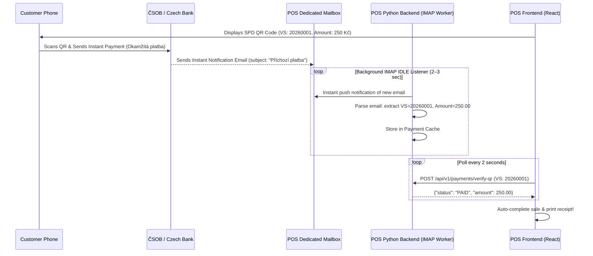

# Real-Time QR Payment Verification via Email Notifications

An architecture design and complete implementation guide for real-time (2–5 second) QR payment verification in **Himmel POS** using automated bank email notifications.

---

## 1. Overview & How It Works



---

## 2. Bank Email Notification Formats (Czech Banks)

### ČSOB Email Notification Example
```text
Od: oznameni@csob.cz
Předmět: Oznámení o zaúčtování položky na účtu

Na Vašem účtu CZ6508000000001234567890 došlo k zaúčtování příchozí platby:
Částka: 250,00 CZK
Variabilní symbol: 20260001
Zpráva pro příjemce: Nákup Himmel POS
```

### Fio Banka / Air Bank Example
```text
Od: servis@fio.cz
Předmět: Fio banka - nova prichozí platba

Castka: 250.00 CZK
VS: 20260001
Ucet: 1234567890/2010
```

---

## 3. Python Service Implementation

Below is the production-ready service module to add to `backend/services/email_payment_listener.py`.

```python
import re
import email
import imaplib
import threading
import time
import logging
from datetime import datetime, timedelta
from typing import Dict, Any, Optional

logger = logging.getLogger("pos-email-listener")

class PaymentCache:
    """In-memory thread-safe TTL cache for received bank payments."""
    def __init__(self, ttl_seconds: int = 1800):  # Keep payments for 30 minutes
        self._cache: Dict[str, Dict[str, Any]] = {}
        self._lock = threading.Lock()
        self.ttl = ttl_seconds

    def add_payment(self, variable_symbol: str, amount: float, raw_subject: str = ""):
        with self._lock:
            vs = str(variable_symbol).strip()
            self._cache[vs] = {
                "amount": float(amount),
                "timestamp": datetime.now(),
                "subject": raw_subject
            }
            logger.info(f"✅ Real-time payment cached: VS={vs}, Amount={amount} CZK")

    def get_payment(self, variable_symbol: str) -> Optional[Dict[str, Any]]:
        with self._lock:
            vs = str(variable_symbol).strip()
            payment = self._cache.get(vs)
            if not payment:
                return None
            
            # Check TTL
            if datetime.now() - payment["timestamp"] > timedelta(seconds=self.ttl):
                del self._cache[vs]
                return None
            
            return payment

    def cleanup(self):
        with self._lock:
            now = datetime.now()
            expired = [vs for vs, data in self._cache.items() if now - data["timestamp"] > timedelta(seconds=self.ttl)]
            for vs in expired:
                del self._cache[vs]


payment_cache = PaymentCache()


def parse_bank_email(subject: str, body: str) -> Optional[Dict[str, Any]]:
    """
    Parses Czech bank email text for Variable Symbol and Amount.
    Supports ČSOB, KB, Fio, Air Bank, Raiffeisen.
    """
    text = f"{subject}\n{body}"
    
    # 1. Extract Variable Symbol (X-VS or VS or Variabilní symbol)
    vs_match = re.search(r'(?:Variabilní\s+symbol|VS|Var\.?\s*sym\.?|X-VS)[\s:]*(\d{1,10})', text, re.IGNORECASE)
    if not vs_match:
        return None
    
    variable_symbol = vs_match.group(1).strip()

    # 2. Extract Amount (e.g. 250,00 CZK, 250.00 Kč, Částka: 1500)
    amount_match = re.search(r'(?:Částka|Castka|Suma|Amount)[\s:]*([\d\s]+(?:[.,]\d{1,2})?)\s*(?:CZK|Kč)?', text, re.IGNORECASE)
    if not amount_match:
        # Fallback regex for standalone amount like "250,00 CZK"
        amount_match = re.search(r'([\d\s]+[.,]\d{2})\s*(?:CZK|Kč)', text)

    if not amount_match:
        return None

    raw_amount = amount_match.group(1).replace(" ", "").replace(",", ".")
    try:
        amount = float(raw_amount)
    except ValueError:
        return None

    return {
        "variable_symbol": variable_symbol,
        "amount": amount
    }


class EmailPaymentListenerThread(threading.Thread):
    """Background worker that monitors IMAP inbox using IDLE / Polling."""
    def __init__(self, imap_server: str, username: str, password: str, poll_interval: int = 5):
        super().__init__(daemon=True)
        self.imap_server = imap_server
        self.username = username
        self.password = password
        self.poll_interval = poll_interval
        self.running = False

    def run(self):
        self.running = True
        logger.info(f"📧 Starting Bank Email Listener for account: {self.username}")
        
        while self.running:
            try:
                mail = imaplib.IMAP4_SSL(self.imap_server)
                mail.login(self.username, self.password)
                mail.select("INBOX")

                # Search UNSEEN emails
                status, messages = mail.search(None, 'UNSEEN')
                if status == 'OK':
                    email_ids = messages[0].split()
                    for e_id in email_ids:
                        res, msg_data = mail.fetch(e_id, '(RFC822)')
                        for response_part in msg_data:
                            if isinstance(response_part, tuple):
                                msg = email.message_from_bytes(response_part[1])
                                subject = msg.get("Subject", "")
                                
                                # Extract Body
                                body = ""
                                if msg.is_multipart():
                                    for part in msg.walk():
                                        if part.get_content_type() == "text/plain":
                                            body = part.get_payload(decode=True).decode('utf-8', errors='ignore')
                                            break
                                else:
                                    body = msg.get_payload(decode=True).decode('utf-8', errors='ignore')

                                parsed = parse_bank_email(subject, body)
                                if parsed:
                                    payment_cache.add_payment(
                                        parsed["variable_symbol"],
                                        parsed["amount"],
                                        subject
                                    )

                mail.close()
                mail.logout()

            except Exception as e:
                logger.warning(f"IMAP listener loop warning: {e}")

            payment_cache.cleanup()
            time.sleep(self.poll_interval)

    def stop(self):
        self.running = False
```

---

## 4. Integration into POS Backend Route

Modify `backend/routers/payments.py` to check `payment_cache`:

```python
from services.email_payment_listener import payment_cache

@router.post("/verify-qr")
def verify_qr_payment(req: VerifyQRPaymentRequest):
    """
    Checks if an incoming payment matching variableSymbol & expectedAmount has arrived.
    """
    payment = payment_cache.get_payment(req.variableSymbol)
    
    if payment:
        if payment["amount"] >= req.expectedAmount:
            return {
                "status": "PAID",
                "variable_symbol": req.variableSymbol,
                "expected_amount": req.expectedAmount,
                "received_amount": payment["amount"],
                "message": "Platba úspěšně přijata v reálném čase!"
            }
    
    return {
        "status": "PENDING",
        "variable_symbol": req.variableSymbol,
        "expected_amount": req.expectedAmount,
        "received_amount": 0.0,
        "message": "Čeká se na provedení okamžité platby zákazníkem..."
    }
```

---

## 5. Summary & Advantages

1. **Zero Monthly Fees:** No paid payment gateway needed.
2. **2–5 Second Response Time:** Customer scans QR, approves on phone, POS updates automatically.
3. **Easy Enablement:** Requires a simple Gmail/Seznam/custom IMAP mailbox receiving bank alerts.
