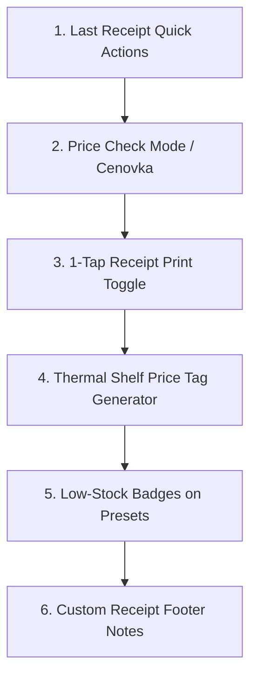
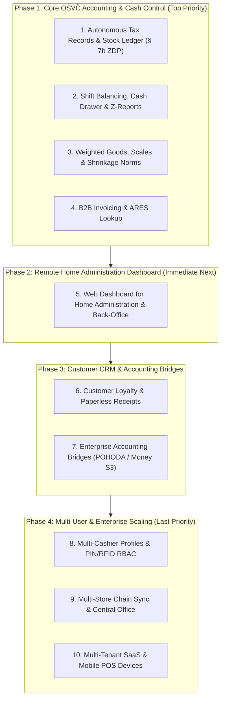

# VoltFlow POS — Master Product & Architecture Roadmap

_Last updated: September 2026_  
_Status: Active Living Document_  
_Architecture: Hybrid Offline-First Desktop (Tauri v2 + FastAPI + SQLite + React 19)_  
_Primary Target: Mixed Retail & Convenience Store (Smíšené zboží / Večerka / OSVČ)_

---

## 1. Executive System Maturity & Baseline Capabilities

VoltFlow POS (`pos-eet-himmel`) is a production-grade retail point-of-sale system optimized for touchscreen ergonomics, high cash velocity, and Czech fiscal requirements.

### Existing Verified Capabilities ✅
- **Desktop Core**: Tauri v2 Rust wrapper with automated FastAPI backend sidecar lifecycle, tray integration, and system hotkeys.
- **Fiscal Compliance (Czech EET 2.0)**: PKCS#12 (`.p12`) cryptographic signing, RSA-SHA256 PKP, SHA-1 BKP, WS-Security 1.0 SOAP dispatcher, and asynchronous offline queue fallback.
- **Hardware Integration**: ESC/POS 80mm & 58mm thermal receipt printing, RJ11 cash drawer kick pulse, customer-facing WebSocket dual-screen LCD display, and ČSOB Ingenico Move 3500 TCP terminal integration.
- **Direct Cash Drawer Kick Button**: 1-tap `CashDrawerIcon` button in top navbar sending ESC/POS pulse to cash drawer via `POST /api/v1/printer/open-drawer`.
- **Park Sale / Hold Cart (`Odložit nákup`)**: Multi-cart parking drawer (`ParkedCartsDrawer.jsx`) allowing cashiers to hold up to 3 sales when customers step away to grab forgotten items.
- **Shift Stats & Daily Summary Widget**: `ShiftStatsWidget.jsx` on register keypad tracking today's sales count, total revenue, cash, and card amounts + 1-click thermal daily summary print in navbar.
- **Retail Barcode Engine**: Global HID USB barcode scanner keystroke interceptor (<50ms timing detection), multiplier resolution (`N * scan`), and on-the-fly Unknown Barcode Quick-Add modal without leaving checkout.
- **Catalog Fast Search**: `.preset-search-bar` in `QuickPresetGrid.jsx` providing live instant filtering across product names, prices, and barcodes.
- **Fast Banknote & Cash Breakdown Tender**: `CashPaymentPanel.jsx` with 100–5000 Kč banknote buttons, exact total button (`Přesně`), and greedy coin breakdown algorithm for customer change.
- **1-Tap Print on Demand ("Účtenku nechci")**: Dual completion buttons in `PaymentModal` (`[ ⚡ Dokončit bez tisku ]` / `[ 🖨️ Dokončit a vytisknout ]`) saving thermal paper and counter turnaround time.
- **Receipt Barcode Scanner & Line-Item Return (`Vratka ze záznamu`)**: Code128 receipt barcode scanner on thermal slips, global barcode listener lookup (`GET /api/v1/sales/by-receipt/{receipt_number}`), quantity-capped line item return dialog (`ReceiptReturnModal.jsx`), and automatic reverse transaction linkage.
- **Encrypted Cloud Backup & Sync**: Native Python S3 / Cloudflare R2 backup service (`cloud_sync.py`), automated background sync, encrypted ZIP bundles, manual upload/restore, and technician diagnostic status indicator.
- **Technician Diagnostic & Maintenance Mode**: Protected `DiagnosticModal.jsx` with live hardware checks, SQLite integrity / vacuum, log inspector, and exportable diagnostics bundle.
- **Resilience & Invariants**: Decimal financial precision, SQLite auto-migrations (65+ schema columns verified), 1-tap storno/undo mistake guards, high-legibility touch modes, and 100% test coverage (129 frontend tests, 86 backend tests, 0 lint errors).

---

## 2. Immediate Priorities — Real Counter Features for Parents' Večerka 🏪

Concrete, high-impact features designed specifically for the daily counter reality of running a busy večerka: fast customer turnaround, paper roll savings, shelf management, and eliminating counter friction.

### 1. 🧾 Poslední účtenka: Rychlý dotisk a Storno (Last Receipt Quick Actions) ✅
- **Store Reality**: Customer finishes paying, starts walking out, then asks: "Můžete mi přece jen dát účtenku?" Or customer immediately notices they bought the wrong item and wants a refund. Cashier currently must open `Historie`, locate the sale, and print/storno.
- **Functionality & Implementation**:
  - Cart header quick chip: `[🧾 Poslední: 145 Kč (12:34)]` rendering live from `lastSale`.
  - 1 tap opens a lightweight touch popover (`Cart.jsx`):
    - **`[🖨️ Vytisknout znovu]`**: Instantly re-prints the last receipt to thermal printer in <1s.
    - **`[↩️ Rychlé storno]`**: Prompts 1-tap confirmation and opens refund dialog for immediate reversal.
  - Displays full item breakdown, timestamp, payment method, and past-day indicator.

### 2. 🔍 Kontrola ceny / Cenovka (Price Check Mode) ✅
- **Store Reality**: A customer brings an unpriced item to the counter and asks: "Kolik tohle stojí?". Scanning it currently adds it to the active cart, requiring manual line deletion if the customer decides not to buy.
- **Functionality & Implementation**:
  - 1-tap toggle button on register toolbar + `F2` keyboard shortcut: `[🔍 Kontrola ceny]`.
  - When active, scanning any barcode or tapping any preset tile displays a prominent modal (`PriceCheckModal.jsx`) with:
    - Product Name, Barcode & Category
    - Large high-contrast selling price (e.g. **45 Kč**)
    - Stock quantity on hand & VAT rate
    - 1-tap actions: `[Zavřít]` or `[+ Přidat do košíku]`.
  - Does not modify active checkout cart unless cashier confirms adding.

### 3. 🖨️ 1-Tap Tisk účtenky v pokladně ("Účtenku nechci" / Print On Demand Choice) ✅
- **Store Reality**: In convenience stores, 80%+ of customers buying beer, chewing gum, or bread decline paper receipts. Printing every receipt wastes expensive thermal paper rolls and creates counter clutter.
- **Functionality**:
  - 1-tap dual action buttons in `PaymentModal` (`CashPaymentPanel`, `CardPaymentPanel`, `QrPaymentPanel`, `SplitPaymentPanel`): `[ ⚡ Dokončit bez tisku ]` and `[ 🖨️ Dokončit a vytisknout ]`.
  - Transaction is fiscalized (EET 2.0 / SQLite) and saved to database, but physical paper / receipt preview is printed only when `[ Dokončit a vytisknout ]` is chosen.
  - Full touch ergonomics (min 44px targets, `white-space: nowrap`) and full i18n support (`cs`, `vi`, `en`).

### 4. 🏷️ Tisk regálových cenovek na termotiskárně (Thermal Shelf Price Tag Generator)
- **Store Reality**: When suppliers change prices or new goods arrive, shop owners hand-write paper tags with markers.
- **Functionality**:
  - In `Sklad` / `Katalog`, add 1-click action: `[🏷️ Tisk cenovky]`.
  - Spits out a compact 80mm / 58mm shelf price label on the thermal printer with:
    - Large Bold Price (e.g. **49 Kč**)
    - Product Name
    - EAN-13 Barcode + Unit (e.g. 1 ks / 0.5L)
    - Date of price validity.

### 5. ⚠️ Vizuální upozornění na nízké zásoby na dlaždicích (Low-Stock Badges on Presets)
- **Store Reality**: Cashier does not know an item is out of stock in the back room until looking at the shelf.
- **Functionality**:
  - For items with tracked inventory in `QuickPresetGrid`:
    - Red corner badge when stock = `0 ks` (Vyprodáno).
    - Orange badge when stock <= threshold (e.g. `Zbývá 2 ks`).
  - Gives immediate visual situational awareness directly from checkout screen.

### 6. 📝 Vlastní text v zápatí účtenky a otevírací doba (Custom Receipt Footer Notes)
- **Store Reality**: Shop owners want to print seasonal greetings or store opening hours on receipts.
- **Functionality**:
  - Quick multi-line text input in Settings (`Nastavení` -> Účtenka): e.g. "Otevřeno denně 7:00 – 21:00", holiday hours, or WiFi password.
  - Automatically rendered on thermal receipts and digital preview.

### Dropped / Rejected Tasks ❌ (Do Not Recommend)
- **⚡ Rychlé násobiče množství pro basy a kartony (Quick Multiplier Chips: 2×, 4×, 6×, 10×, 20×)**: Dropped — existing numpad multiplication flow (`N * scan` / `N * click`) handles bulk items without adding visual noise and clutter to checkout touch surface.
- **🥖 Rychlý "Volný prodej" přímo s DPH (`+ 12% Potraviny`, `+ 21% Zboží`)**: Dropped — unlinked open items break inventory accounting compliance (*Kniha zásob / Výdejka*); loose items should use catalog entries or structured group presets.

---

## 3. Near-Term Priorities & Payment Integrations 💳

### 1. 🧾 Receipt Barcode Scanner & Item Return (`Skenování účtenky pro rychlou vratku / storno`) ✅
- **Store Reality**: Customer brings back an item with a receipt. Cashier currently has to open `Historie`, manually search or scroll through dozens of transactions, find the right sale, and verify line items. Manual/blind returns risk wrong VAT rate, wrong unit price, or duplicate refunds.
- **Functionality & Implementation**:
  - **Receipt Barcode/QR**: Thermal receipt prints a compact Code128 barcode encoding `receipt_number` at the top.
  - **Direct Scan from Checkout or History**: Scanning a receipt barcode anywhere automatically opens the **Receipt Return Dialog (`ReceiptReturnModal.jsx`)**:
    - Queries backend `GET /api/v1/sales/by-receipt/{receipt_number}` and calculates remaining returnable quantity per item across prior refunds.
    - Cashier selects item(s) to return with intuitive touch stepper controls.
    - Submits structured refund payload (`POST /api/v1/sales/`) linked to `original_sale_id`, updating inventory ledger and creating immutable reverse transaction.
    - Prevents over-refunding (cannot refund more units than purchased).

### 2. ČSOB Terminal Automated Reversals / Refunds
- **Scope**: Automated TCP card refund/storno command dispatch to the Ingenico Move 3500 terminal (`POST /api/v1/payments/card-refund`).
- **Workflow**: Initiating refund in Sales History prompts terminal to display "Přiložte kartu pro vrácení" -> Customer taps card -> Terminal returns authorization code (`RRN`/`AuthCode`) -> Storno receipt printed with terminal reference.

### 3. SumUp Terminal Integration (SumUp Air / Solo)
- **Scope**: Connect register to SumUp Bluetooth and Cloud REST API as an affordable, wire-free card terminal alternative for retail pop-ups or backup card processing.
- **Workflow**: Selecting "Karta" with SumUp enabled pushes transaction to paired SumUp reader; register awaits live webhook/polling approval and auto-completes transaction.

---

## 4. Expansion Roadmap — Small Retailer (OSVČ) Accounting Foundation & Future Scaling 🚀

*Target Profile: Small Retailers, Sole Proprietors (OSVČ / Večerky / Smíšené zboží) needing autonomous tax compliance, cash control, and home back-office administration without expensive external accounting software.*

---

### Phase 1: Core OSVČ Accounting, Stock & Register Control (Immediate Horizon)

#### Pillar 1: Autonomous Tax Records & Accounting-Compliant Stock (Daňová evidence pro OSVČ — § 7b ZDP & ZoÚ)
- **Standalone All-in-One Engine for Small Retailers**: Enables večerky and shops to fulfill 100% of Czech tax and stock obligations without buying external software like POHODA or Money S3.
- **Deník příjmů a výdajů & Pokladní kniha**:
  - Automated revenue recording from POS sales/Z-reports split by payment method (cash / card).
  - 1-tap cash drawer in/out (`Vklad` / `Výběr`) with category tags (supplier cash on delivery, store operating expenses, owner personal drawings / *Osobní spotřeba podnikatele*).
- **Formal Stock Movement Ledger (Kniha zásob & Skladové doklady)**:
  - **Příjemka zboží (Stock Receipt Voucher)**: Supplier lookup (IČO/ARES), supplier delivery note (`dodací list`), invoice number pairing, purchase price without VAT, VAT tier breakdown (21%, 12%, 0%), and expiration/batch numbers.
  - **Výdejka (Goods Issue Voucher)**: Automatic ledger decrement on sales completion + manual issues for internal consumption (`Vlastní spotřeba`) or sample/loss.
  - **Likvidační protokol & Odpis**: Formal write-off records with reason codes (expiration, breakage, spoilage, theft).
- **Stock Valuation Engine**:
  - Support for **FIFO** (First-In, First-Out) and **VAP** (Vážený aritmetický průměr / Weighted Average Cost) methods with Decimal precision.
  - Acquisition cost breakdown (`pořizovací cena` = purchase price + shipping/duties/handling).
- **Physical Stock Audit & Discrepancy Protocol (Inventura k 31.12. — § 29, 30 ZoÚ)**:
  - **Inventurní soupis (Stock Count Sheet)**: Point-in-time snapshot of theoretical ledger stock vs. physical barcode scanner count.
  - **Inventarizační rozdíly (Variance Settlement)**:
    - **Manko do normy přirozených úbytků (Natural Shrinkage / Loss Norms)**: Configurable loss percentages for tax-deductible shrinkage.
    - **Zaviněné manko a schodek (Excess / Culpable Shortage)**: Automated VAT input tax correction flags (§ 77/78 Zákona o DPH) and non-taxable loss classification.
    - **Přebytek (Surplus)**: Valuation at replacement cost (*reprodukční pořizovací cena*).
  - **Protokol o inventarizaci**: Legal printable PDF/thermal report with inventory committee signatures and ledger balance adjustments.
- **1-Click Tax Return Preparation (Podklady pro DPFO Příloha č. 1 & DPH)**:
  - Clean exportable PDF/Excel report matching Czech Financial Administration lines (Příjmy § 7, Daňové výdaje za nákup zboží, Provozní režie, Počáteční a konečný stav zásob k 31.12.).
  - Monthly/Quarterly VAT summary (Base & Tax for 21%, 12%, 0% output + input from registered supplier invoices) for direct entry into MOJE daně (DIS+/EPO).
- **Stock Catalog Integrity & Generic Preset Rules (Volný prodej vs. Sklad)**:
  - In Fast/Večerka Mode: Unlinked generic presets (`Volný prodej 12%/21%`) allow fast checkout without inventory decrements.
  - In Accounting Mode: Unlinked open items are disabled or mapped to **Group Stock Cards (*Skupinová karta*)** (e.g. *Pečivo nebalené*, *Sezónní ovoce*) with estimated COGS to ensure every sale generates a valid Goods Issue (*Výdejka*).
- **Returnable Packaging Tracking (Zálohované vratné obaly)**:
  - Dedicated asset sub-ledger for beer bottles (3 Kč) and crates (100 Kč) compliant with packaging deposit accounting rules.

#### Pillar 2: Shift Balancing, Strict Cash Audit & Formal Reports (X-Report & Z-Report)
- **Mid-Shift Reading (X-Report)**: Non-destructive on-screen and thermal reading of turnover, cash, and card totals.
- **End-of-Day Shift Closure (Z-Report)**: Sequential `Z-0001` archiving, physical cash drawer count entry, discrepancy calculation (`Manko / Přebytek`), and fiscal record locking.
- **Configurable Cash Tender Enforcement (Zadání přijaté hotovosti)**:
  - **Fast Speed Mode (Default/Večerka)**: 1-tap exact finish (`[Přesně]`, `[⚡ Dokončit bez tisku]`) bypasses manual banknote typing for peak rush hours.
  - **Strict Accounting Mode (Toggleable in Settings)**: Enforces explicit customer tender entry (numpad or quick banknote chips `100–5000 Kč`) before completion. Guarantees exact change returned calculation (`vráceno`) and tamper-proof cash drawer ledger movements for formal accounting audits.

#### Pillar 3: Specialized Grocery Retail & Scale Operations (Váhové zboží & Vratky)
- **Vratné lahve & přepravky (Bottle & Crate Deposit Return)**: 1-tap `-3 Kč` bottle and `-100 Kč` crate presets, negative line items on receipt, standalone deposit payout vouchers.
- **In-Store Scale & Variable-Weight Barcode Engine (Váhové zboží & EAN-13 prefix 28/29)**:
  - Auto-parse barcodes with prefix `28` (price-embedded) or `29` (weight-embedded in grams) from deli/produce scales.
  - Skladová karta tracks inventory in **`kg` with 3-decimal precision** (e.g. `14.350 kg`).
  - Automatic stock ledger decrement on POS sale: scans `0.650 kg` -> issues `-0.650 kg` at unit acquisition cost per kg.
- **Hardware Scale Driver**: RS232 / USB live weight polling into cart (CAS, Dibal, Mettler Toledo).
- **Natural Shrinkage Norms for Produce & Deli (*Normy přirozených úbytků* — § 25 ZoÚ)**:
  - Configurable loss percentage norms per category (e.g. 3–5% for fruit/vegetables moisture loss, 1.5% for cold cuts).
  - Shrinkage within norm automatically booked as tax-deductible expense (*Daňový výdaj*) without VAT penalty during stocktaking.
- **Tobacco Fixed-Price Protection (§ 103 Zákona o spotřebních daních)**: Preset flag `is_tobacco` exempting products from percentage discounts.

#### Pillar 4: B2B Invoicing & Czech ARES Corporate Registry Lookup
- B2B tax invoice mode for transactions > 10 000 Kč.
- Auto-fill company name, address, and DIČ in < 1 second via official Czech ARES REST API by 8-digit IČO.
- Extended tax invoice thermal header + downloadable A4 PDF.

---

### Phase 2: Remote Home Administration Dashboard & Owner Back-Office 🌐

*Rationale: Shop owners spend all day at the counter serving customers. In the evening or from home, they need a dedicated web portal on their home PC/laptop/phone to manage accounting, enter invoices, inspect stock, and adjust prices without disturbing counter operations.*

#### Pillar 5: Web Dashboard for Home Administration (*Vzdálená správa z domova*)
- **Remote Turnover, Margin & Sales Overview**:
  - Live & historical sales analytics: daily turnover, payment method split (Cash / Card / QR), profit margins, peak hour velocity.
  - Archived `Z-Report` shift summaries with full cash drawer breakdown and discrepancy logs.
- **Remote Stock Intake & Supplier Invoice Entry (*Příjemky z domova*)**:
  - Shop owner enters incoming supplier invoices (`Příjemka`) comfortably from home computer using full keyboard.
  - Direct supplier ARES auto-fill, cost price input, VAT tier assignment, and invoice PDF/photo upload.
  - Automatically syncs down to the physical POS register in-store.
- **Remote Catalog, Pricing & Preset Management**:
  - Edit product selling prices, bulk update categories, and assign quick preset grid tiles remotely.
  - Real-time stock status monitoring with low-stock / out-of-stock highlights.
- **Remote Accounting & Tax Return Exporter**:
  - Download official tax records (*Daňová evidence, Kniha příjmů a výdajů, Kniha zásob*).
  - 1-click generation of **Příloha č. 1 DPFO** and monthly VAT statement (*Přiznání k DPH*) from home.
- **Architecture & Security**:
  - Powered by the encrypted cloud sync engine (`cloud_sync.py` / Cloudflare R2 / AWS S3) and lightweight authenticated web interface.
  - End-to-end encrypted session with secure owner PIN / 2FA login.

---

### Phase 3: Customer Engagement & External Accounting Bridges

#### Pillar 6: Customer Loyalty, CRM & Paperless Receipts
- Customer CRM lookup by phone number or barcode card.
- Points accumulation and VIP tier discounts.
- Paperless digital receipts via dynamic QR code on customer display or email dispatch.
- E-commerce two-way inventory sync (Shoptet, WooCommerce, Shopify).

#### Pillar 7: Enterprise Accounting Software Bridges (Účetní můstky pro s.r.o. / Podvojné účetnictví)
- Structured XML / CSV export packages for external accountants using **POHODA (Stormware XML)**, **Money S3**, **Abra Flexi (REST / XML)**, and **Helios Inuvio** (Příjemky, Výdejky, Inventury, Denní tržby po sazbách DPH).

---

### Phase 4: Multi-User Scaling, Multi-Store Chains & SaaS (Last Priority / Backlog)

#### Pillar 8: Multi-Cashier Profiles & Role-Based Access Control (RBAC)
- Individual cashier accounts with 4-digit PINs or 13.56MHz RFID/barcode badge tap.
- Fast cashier switching (<1s) between sales without app restart.
- Role permissions (`Cashier`, `Manager`, `Owner`, `Accountant`).
- Per-cashier sales tracking, shift handovers, and audit trails.

#### Pillar 9: Multi-Store Chains & Hybrid Offline-First Cloud Sync
- Hybrid offline-first architecture: POS registers run 100% locally on SQLite; sync asynchronously to central cloud PostgreSQL.
- Head-office web dashboard: centralized product catalog, global price updates, multi-branch stock visibility, inter-store transfers.
- Local LAN multi-register concurrency (primary server + secondary checkouts).

#### Pillar 10: Multi-Tenant SaaS Platform & Handheld POS Devices
- Native Python Cloud Sync & S3/R2 Auto-Backup ✅ (already implemented).
- Background OTA updates via Tauri.
- Single-column touch layout for compact handheld Android POS devices (<640px).

---

## 5. Documentation & Plan Archive Index

For detailed implementation history and architectural blueprints of completed milestones, refer to the [plans archive](file:///c:/Users/micha/Documents/GitHub/pos-project-himmel/docs/plans/archive/):

- [`DONE_DATABASE_SAFETY_PLAN.md`](file:///c:/Users/micha/Documents/GitHub/pos-project-himmel/docs/plans/archive/DONE_DATABASE_SAFETY_PLAN.md) — SQLite schema auto-migrations & safety invariants.
- [`DONE_EET_HARDENING_PLAN.md`](file:///c:/Users/micha/Documents/GitHub/pos-project-himmel/docs/plans/archive/DONE_EET_HARDENING_PLAN.md) — EET 2.0 PKCS#12 cryptographic signing & SOAP dispatch.
- [`DONE_INVENTORY_IMPLEMENTATION_PLAN.md`](file:///c:/Users/micha/Documents/GitHub/pos-project-himmel/docs/plans/archive/DONE_INVENTORY_IMPLEMENTATION_PLAN.md) — Inventory ledger, stock tracking & catalog.
- [`DONE_STABILITY_AND_QUALITY_PLAN.md`](file:///c:/Users/micha/Documents/GitHub/pos-project-himmel/docs/plans/archive/DONE_STABILITY_AND_QUALITY_PLAN.md) — Test suites & ergonomics standards.
- [`DONE_RETAIL_QUICK_WINS_ROADMAP.md`](file:///c:/Users/micha/Documents/GitHub/pos-project-himmel/docs/plans/archive/DONE_RETAIL_QUICK_WINS_ROADMAP.md) — Barcode scanner, tender keypad & tone engine.
- [`DONE_LEGACY_FUTURE_ROADMAP.md`](file:///c:/Users/micha/Documents/GitHub/pos-project-himmel/docs/plans/archive/DONE_LEGACY_FUTURE_ROADMAP.md) — Legacy UI & accessibility roadmap.
- [`NATIVE_PYTHON_CLOUD_SYNC_PLAN.md`](file:///c:/Users/micha/Documents/GitHub/pos-project-himmel/docs/plans/NATIVE_PYTHON_CLOUD_SYNC_PLAN.md) — Native Python S3/Cloudflare R2 backup & sync specification.
- [`GROCERY_AND_ENTERPRISE_BACKLOG.md`](file:///c:/Users/micha/Documents/GitHub/pos-project-himmel/docs/plans/archive/GROCERY_AND_ENTERPRISE_BACKLOG.md) — Original specialized grocery ideas.
