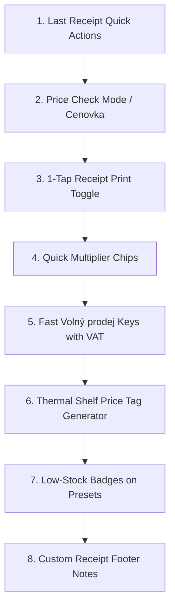
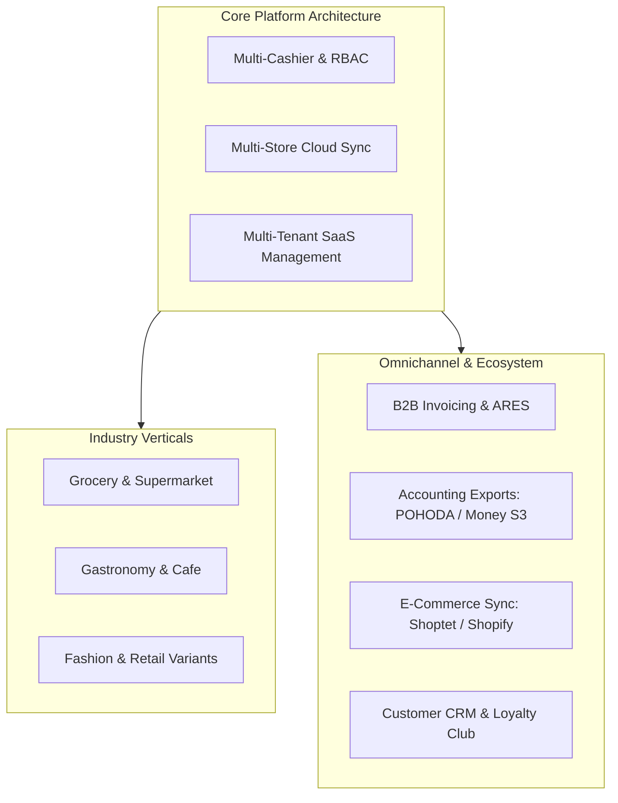

# VoltFlow POS — Master Product & Architecture Roadmap

_Last updated: September 2026_  
_Status: Active Living Document_  
_Architecture: Hybrid Offline-First Desktop (Tauri v2 + FastAPI + SQLite + React 19)_  
_Primary Target: Mixed Retail & Convenience Store (Smíšené zboží / Večerka)_

---

## 1. Executive System Maturity & Baseline Capabilities

VoltFlow POS (`pos-eet-himmel`) is a production-grade retail point-of-sale system optimized for touchscreen ergonomics, high cash velocity, and Czech fiscal requirements.

### Existing Verified Capabilities ✅
- **Desktop Core**: Tauri v2 Rust wrapper with automated FastAPI backend sidecar lifecycle, tray integration, and system hotkeys.
- **Fiscal Compliance (Czech EET 2.0)**: PKCS#12 (`.p12`) cryptographic signing, RSA-SHA256 PKP, SHA-1 BKP, WS-Security 1.0 SOAP dispatcher, and asynchronous offline queue fallback.
- **Hardware Integration**: ESC/POS 80mm & 58mm thermal receipt printing, RJ11 cash drawer kick pulse, customer-facing WebSocket dual-screen LCD display, and ČSOB Ingenico Move 3500 TCP terminal integration.
- **Direct Cash Drawer Kick Button**: 1-tap `CashDrawerIcon` button in top navbar sending ESC/POS pulse to cash drawer via `POST /api/v1/printer/open-drawer`.
- **Park Sale / Hold Cart (`Odložit nákup`)**: Multi-cart parking drawer (`ParkedCartsDrawer.jsx`) allowing cashiers to hold up to 3 sales when customers step away to grab forgotten items.
- **Shift Stats & Daily Summary Widget**: `ShiftStatsWidget.jsx` on register keypad tracking today's sales count, total revenue, cash, and card amounts + 1-click thermal daily summary print in navbar.
- **Retail Barcode Engine**: Global HID USB barcode scanner keystroke interceptor (<50ms timing detection), multiplier resolution (`N * scan`), and on-the-fly Unknown Barcode Quick-Add modal without leaving checkout.
- **Catalog Fast Search**: `.preset-search-bar` in `QuickPresetGrid.jsx` providing live instant filtering across product names, prices, and barcodes.
- **Fast Banknote & Cash Breakdown Tender**: `CashPaymentPanel.jsx` with 100–5000 Kč banknote buttons, exact total button (`Přesně`), and greedy coin breakdown algorithm for customer change.
- **1-Tap Print on Demand ("Účtenku nechci")**: Dual completion buttons in `PaymentModal` (`[ ⚡ Dokončit bez tisku ]` / `[ 🖨️ Dokončit a vytisknout ]`) saving thermal paper and counter turnaround time.
- **Resilience & Invariants**: Decimal financial precision, SQLite auto-migrations (65+ schema columns verified), 1-tap storno/undo mistake guards, high-legibility touch modes, and 100% test coverage (113 frontend tests, 83 backend tests, 0 lint errors).

---

## 2. Immediate Priorities — Real Counter Features for Parents' Večerka 🏪

These are concrete, high-impact features designed specifically for the daily reality of running a busy večerka: fast customer turnaround, paper roll savings, shelf management, and eliminating counter friction.

### 1. 🧾 Poslední účtenka: Rychlý dotisk a Storno (Last Receipt Quick Actions)
- **Store Reality**: Customer finishes paying, starts walking out, then asks: "Můžete mi přece jen dát účtenku?" Or customer immediately notices they bought the wrong item and wants a refund. Cashier currently must open `Historie`, locate the sale, and print/storno.
- **Functionality**:
  - Top bar chip / cart footer widget: `[🧾 Poslední: 145 Kč (12:34)]`.
  - 1 tap opens a lightweight touch popover:
    - **`[🖨️ Vytisknout znovu]`**: Instantly re-prints the last receipt to thermal printer in <1s.
    - **`[↩️ Rychlé storno]`**: Prompts 1-tap confirmation and issues a reverse refund transaction immediately.

### 2. 🔍 Kontrola ceny / Cenovka (Price Check Mode)
- **Store Reality**: A customer brings an unpriced item to the counter and asks: "Kolik tohle stojí?". Scanning it currently adds it to the active cart, requiring manual line deletion if the customer decides not to buy.
- **Functionality**:
  - 1-tap toggle button on register: `[🔍 Kontrola ceny]`.
  - When active, scanning any barcode displays a prominent, high-contrast modal with:
    - Product Name & Category
    - Selling Price in bold (e.g. **45 Kč**)
    - Stock on hand & VAT rate
    - Actions: `[Zavřít]` or `[+ Přidat do košíku]`.
  - Does not modify or disrupt the current checkout cart unless confirmed.

### 3. 🖨️ 1-Tap Tisk účtenky v pokladně ("Účtenku nechci" / Print On Demand Choice) ✅
- **Store Reality**: In convenience stores, 80%+ of customers buying beer, chewing gum, or bread decline paper receipts. Printing every receipt wastes expensive thermal paper rolls and creates counter clutter.
- **Functionality**:
  - 1-tap dual action buttons in `PaymentModal` (`CashPaymentPanel`, `CardPaymentPanel`, `QrPaymentPanel`, `SplitPaymentPanel`): `[ ⚡ Dokončit bez tisku ]` and `[ 🖨️ Dokončit a vytisknout ]`.
  - Transaction is fiscalized (EET 2.0 / SQLite) and saved to database, but physical paper / receipt preview is printed only when `[ Dokončit a vytisknout ]` is chosen.
  - Full touch ergonomics (min 44px targets, `white-space: nowrap`) and full i18n support (`cs`, `vi`, `en`).

### 4. ⚡ Rychlé násobiče množství pro basy a kartony (Quick Multiplier Chips: 2×, 4×, 6×, 10×, 20×)
- **Store Reality**: Customers constantly buy 6-packs of beer/water, 10 rolls (10× rohlík), or full crates (basa piva / 20 ks). Typing multipliers on numpad slows down queues.
- **Functionality**:
  - Horizontal quick-multiplier chips above presets/keypad: `[ 2× ] [ 4× ] [ 6× ] [ 10× ] [ 20× ] [ 24× ]`.
  - 1 tap sets active multiplier (e.g. `6×`), cashier scans beer bottle or taps preset, item is added as 6 units, and multiplier resets automatically.

### 5. 🥖 Rychlý "Volný prodej" přímo s DPH (`+ 12% Potraviny`, `+ 21% Zboží`)
- **Store Reality**: For loose bakery, vegetables, fruit, flowers, seasonal goods, or newspapers without barcodes. Cashier just wants to enter price and tap one button.
- **Functionality**:
  - Keypad quick action buttons: `[+ 12% Potraviny]` and `[+ 21% Zboží]`.
  - Cashier types e.g. `35` on keypad -> 1-tap `[+ 12% Potraviny]` -> instantly added to cart as "Volný prodej (12%) — 35 Kč" without opening modal forms.

### 6. 🏷️ Tisk regálových cenovek na termotiskárně (Thermal Shelf Price Tag Generator)
- **Store Reality**: When suppliers change prices or new goods arrive, parents hand-write paper tags with markers.
- **Functionality**:
  - In `Sklad` / `Katalog`, add 1-click action: `[🏷️ Tisk cenovky]`.
  - Spits out a compact 80mm / 58mm shelf price label on the thermal printer with:
    - Large Bold Price (e.g. **49 Kč**)
    - Product Name
    - EAN-13 Barcode + Unit (e.g. 1 ks / 0.5L)
    - Date of price validity.

### 7. ⚠️ Vizuální upozornění na nízké zásoby na dlaždicích (Low-Stock Badges on Presets)
- **Store Reality**: Cashier does not know an item is out of stock in the back room until looking at the shelf.
- **Functionality**:
  - For items with tracked inventory in `QuickPresetGrid`:
    - Red corner badge when stock = `0 ks` (Vyprodáno).
    - Orange badge when stock <= threshold (e.g. `Zbývá 2 ks`).
  - Gives immediate visual situational awareness directly from checkout screen.

### 8. 📝 Vlastní text v zápatí účtenky a otevírací doba (Custom Receipt Footer Notes)
- **Store Reality**: Parents want to print seasonal greetings or store opening hours on receipts.
- **Functionality**:
  - Quick multi-line text input in Settings (`Nastavení` -> Účtenka): e.g. "Otevřeno denně 7:00 – 21:00", holiday hours, or WiFi password.
  - Automatically rendered on thermal receipts and digital preview.

---

## 3. Close Future Features — Payment Terminal Enhancements 💳

Targeted hardware payment integrations for near-term implementation:

### 1. ČSOB Terminal Automated Reversals / Refunds
- **Scope**: Automated TCP card refund/storno command dispatch to the Ingenico Move 3500 terminal (`POST /api/v1/payments/card-refund`).
- **Workflow**: Initiating refund in Sales History prompts terminal to display "Přiložte kartu pro vrácení" -> Customer taps card -> Terminal returns authorization code (`RRN`/`AuthCode`) -> Storno receipt printed with terminal reference.

### 2. SumUp Terminal Integration (SumUp Air / Solo)
- **Scope**: Connect register to SumUp Bluetooth and Cloud REST API as an affordable, wire-free card terminal alternative for retail pop-ups or backup card processing.
- **Workflow**: Selecting "Karta" with SumUp enabled pushes transaction to paired SumUp reader; register awaits live webhook/polling approval and auto-completes transaction.

---

## 4. Expansion Roadmap — Scaling for More Customer Users & Multi-Tenant Deployment 🚀

*(Archived backlog and architectural pillars for future commercial packaging, multi-store chains, multi-cashier operations, and SaaS distribution).*

### Pillar 1: Shift Balancing & Formal Reports (X-Report & Z-Report)
- **Mid-Shift Reading (X-Report)**: Non-destructive on-screen and thermal reading of turnover, cash, and card totals.
- **End-of-Day Shift Closure (Z-Report)**: Sequential `Z-0001` archiving, physical cash drawer count entry, discrepancy calculation (`Manko / Přebytek`), and fiscal record locking.

### Pillar 2: Multi-Cashier Profiles & Role-Based Access Control (RBAC)
- Individual cashier accounts with 4-digit PINs or 13.56MHz RFID/barcode badge tap.
- Fast cashier switching (<1s) between sales without app restart.
- Role permissions (`Cashier`, `Manager`, `Owner`, `Accountant`).
- Per-cashier sales tracking, shift handovers, and audit trails.

### Pillar 3: Specialized Grocery Retail Operations
- **Vratné lahve & přepravky (Bottle & Crate Deposit Return)**: 1-tap `-3 Kč` bottle and `-100 Kč` crate presets, negative line items on receipt, standalone deposit payout vouchers.
- **In-Store Scale Barcode Parser (Váhové EAN-13)**: Auto-parse barcodes with prefix `28` (price) or `29` (weight in grams) from deli/produce scales.
- **Hardware Scale Driver**: RS232 / USB live weight polling into cart (CAS, Dibal, Mettler Toledo).
- **Tobacco Fixed-Price Protection (§ 103 Zákona o spotřebních daních)**: Preset flag `is_tobacco` exempting products from percentage discounts.

### Pillar 4: B2B Invoicing & Czech ARES Corporate Registry Lookup
- B2B tax invoice mode for transactions > 10 000 Kč.
- Auto-fill company name, address, and DIČ in < 1 second via official Czech ARES REST API by 8-digit IČO.
- Extended tax invoice thermal header + downloadable A4 PDF.
- Accounting software data exports (POHODA XML, Money S3, Abra Flexi).

### Pillar 5: Smart Stock Replenishment & Physical Inventory Audit
- **Barcode Stock Intake Wizard (Příjemka zboží)**: Scan incoming product barcode, input quantity received & cost, 1-tap stock update.
- **Physical Stock Audit (Inventura)**: Scanner-driven stock count reconciliation with batch adjustment.

### Pillar 6: Multi-Store Chains & Hybrid Offline-First Cloud Sync
- Hybrid offline-first architecture: POS registers run 100% locally on SQLite; sync asynchronously to central cloud PostgreSQL.
- Head-office web dashboard: centralized product catalog, global price updates, multi-branch stock visibility, inter-store transfers.
- Local LAN multi-register concurrency (primary server + secondary checkouts).

### Pillar 7: Customer Loyalty, CRM & Paperless Receipts
- Customer CRM lookup by phone number or barcode card.
- Points accumulation and VIP tier discounts.
- Paperless digital receipts via dynamic QR code on customer display or email dispatch.
- E-commerce two-way inventory sync (Shoptet, WooCommerce, Shopify).

### Pillar 8: SaaS Platform, Auto-Backup & Handheld POS Devices
- Automated encrypted SQLite replication to Cloudflare R2 / AWS S3 via Litestream with in-app status UI.
- Background OTA updates via Tauri.
- Single-column touch layout for compact handheld Android POS devices (<640px).

---

## 5. Documentation & Plan Archive Index

For detailed implementation history and architectural blueprints of completed milestones, refer to the [plans archive](file:///c:/Users/micha/Documents/GitHub/pos-project-himmel/docs/plans/archive/):

- [`DONE_DATABASE_SAFETY_PLAN.md`](file:///c:/Users/micha/Documents/GitHub/pos-project-himmel/docs/plans/archive/DONE_DATABASE_SAFETY_PLAN.md) — SQLite schema auto-migrations & safety invariants.
- [`DONE_EET_HARDENING_PLAN.md`](file:///c:/Users/micha/Documents/GitHub/pos-project-himmel/docs/plans/archive/DONE_EET_HARDENING_PLAN.md) — EET 2.0 PKCS#12 cryptographic signing & SOAP dispatch.
- [`DONE_INVENTORY_IMPLEMENTATION_PLAN.md`](file:///c:/Users/micha/Documents/GitHub/pos-project-himmel/docs/plans/archive/DONE_INVENTORY_IMPLEMENTATION_PLAN.md) — Inventory ledger, stock tracking & catalog.
- [`DONE_STABILITY_AND_QUALITY_PLAN.md`](file:///c:/Users/micha/Documents/GitHub/pos-project-himmel/docs/plans/archive/DONE_STABILITY_AND_QUALITY_PLAN.md) — Test suites & ergonomics standards.
- [`DONE_RETAIL_QUICK_WINS_ROADMAP.md`](file:///c:/Users/micha/Documents/GitHub/pos-project-himmel/docs/plans/archive/DONE_RETAIL_QUICK_WINS_ROADMAP.md) — Barcode scanner, tender keypad & tone engine.
- [`DONE_LEGACY_FUTURE_ROADMAP.md`](file:///c:/Users/micha/Documents/GitHub/pos-project-himmel/docs/plans/archive/DONE_LEGACY_FUTURE_ROADMAP.md) — Legacy UI & accessibility roadmap.
- [`GROCERY_AND_ENTERPRISE_BACKLOG.md`](file:///c:/Users/micha/Documents/GitHub/pos-project-himmel/docs/plans/archive/GROCERY_AND_ENTERPRISE_BACKLOG.md) — Original specialized grocery ideas.
