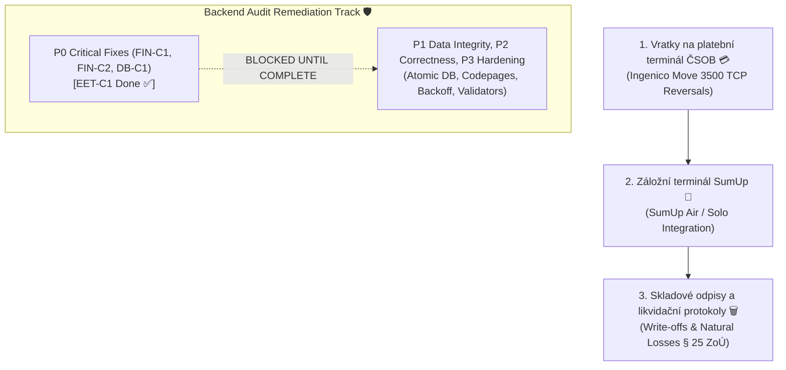
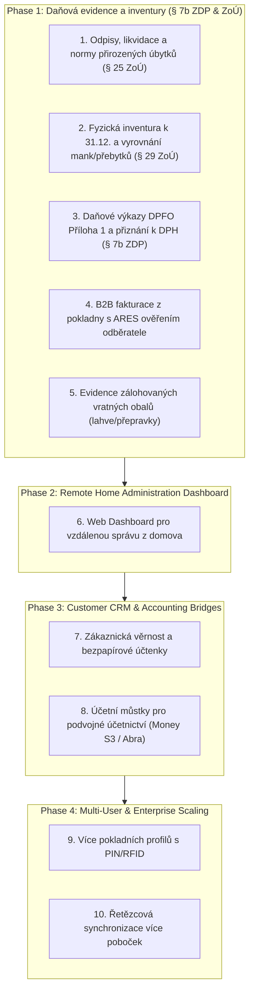

# VoltFlow POS — Master Product & Architecture Roadmap

_Last updated: September 2026_  
_Status: Active Living Document_  
_Architecture: Hybrid Offline-First Desktop (Tauri v2 + FastAPI + SQLite + React 19)_  
_Primary Target: Mixed Retail & Convenience Store (Smíšené zboží / Večerka / OSVČ)_

---

## 1. Immediate Active Priorities (Nejbližší úkoly k realizaci) 🎯

Concrete, high-impact counter and payment features scheduled for immediate implementation.

### 1.1 💳 Automatické vratky platební kartou na terminál ČSOB (ČSOB Terminal Automated Reversals / Refunds)
- **Scope**: Automated TCP card refund/storno command dispatch to the Ingenico Move 3500 terminal (`POST /api/v1/payments/card-refund`).
- **Workflow**: Initiating refund in Sales History prompts terminal to display "Přiložte kartu pro vrácení" -> Customer taps card -> Terminal returns authorization code (`RRN`/`AuthCode`) -> Storno receipt printed with terminal reference.

### 1.2 📶 Záložní terminál SumUp (SumUp Air / Solo Integration)
- **Scope**: Connect register to SumUp Bluetooth and Cloud REST API as an affordable, wire-free card terminal alternative for retail pop-ups or backup card processing.
- **Workflow**: Selecting "Karta" with SumUp enabled pushes transaction to paired SumUp reader; register awaits live webhook/polling approval and auto-completes transaction.

### 1.3 🗑️ Skladové odpisy, likvidační protokoly a normy úbytků (*Likvidace a manka* — § 25 ZoÚ)
- **Scope**: Formal stock write-off workflow (`POST /api/v1/inventory/write-off`) with reasons (`EXSPIRACE`, `ZKÁZA`, `ROZBITÍ`, `KRÁDEŽ`).
- **Accounting & Tax**: Categorized loss norms (§ 25 ZoÚ, e.g. produce shrinkage 3-5%) with tax-deductible status vs. non-deductible taxable loss requiring VAT adjustment (§ 77/78 ZDPH). Thermal write-off protocol slip.

### 1.4 🛡️ Backend Audit Remediation & Hardening (`docs/backend_audit_2026-09-11.md`)
> ⚠️ **Status: BLOCKED** until the most critical legal & financial fixes (P0 Criticals) are completed and verified.
- **Reference**: [`docs/backend_audit_2026-09-11.md`](file:///c:/Users/micha/Documents/GitHub/pos-project-himmel/docs/backend_audit_2026-09-11.md)
- **Phase 1 — Critical Prerequisite Gates (Must complete first)**:
  - **EET-C1**: W3C Exclusive C14N XML-DSig signing via `lxml` + `xmlsec` (DONE ✅ in commit `be330d0`).
  - **FIN-C1**: Server-side VAT recalculation in `routers/sales.py:create_sale` (`Σ(base + vat) == totalAmount`).
  - **FIN-C2**: Sales immutability (block hard deletes of completed sales, enforce reverse refunds).
  - **DB-C1**: Atomic transaction for receipt sequence number generation + sale insertion.
- **Phase 2–4 — Subsequent Remediation (Unblocks once Criticals pass)**:
  - **P1 (Data Integrity)**: Atomic stock decrements (`UPDATE ... SET qty = qty - ?`), `Numeric(10,2)` DB migration for monetary columns, EET certificate validity check (`not_valid_after_utc`).
  - **P2 (Correctness)**: Codepage-aware ESC/POS thermal printing (CP852 Czech, CP1258 Vietnamese), printer auto-reconnect decorator, Decimal math in cash register.
  - **P3 (Hardening)**: Pydantic VAT rate validators (`vat in {0, 12, 21}`), sales timestamp indexing, logo payload size limiter.

---

## 2. Strategic Expansion Phases (Střednědobý a dlouhodobý plán) 🚀

*Target Profile: Small Retailers, Sole Proprietors (OSVČ / Večerky / Smíšené zboží) needing autonomous tax compliance, cash control, and home back-office administration without expensive external accounting software.*

### Phase 1: Daňová evidence a inventury pro OSVČ (Remaining Scope — § 7b ZDP & ZoÚ)

*Poznámka: Základní stavební kameny daňové evidence (Deník příjmů a výdajů, Pokladní kniha, Vklady/Výběry, Směnové uzávěrky X/Z-Report, Příjemky s ARES a Výdejky prodejem) jsou již plně implementovány v produkční verzi viz Sekce 3.*

#### 1. Skladové odpisy, likvidační protokoly a normy úbytků (*Likvidace a manka* — § 25 ZoÚ)
- **Store Reality**: V potravinách dochází ke zkáze zeleniny, prošlému pečivu, rozbitým lahvím od piva a drobným krádežím. Pokud se tyto odpisy neevidují formálně, zkreslují sklad a berňák je může penalizovat doměřením DPH.
- **Functionality**:
  - Samostatný formulář pro **Odpis zboží / Likvidační protokol** (`POST /api/v1/inventory/write-off`).
  - Důvody odpisu: `EXSPIRACE`, `ZKÁZA`, `ROZBITÍ`, `KRÁDEŽ / NEZJIŠTĚNÉ MANKO`.
  - **Normy přirozených úbytků (§ 25 ZoÚ)**:
    - Nastavitelné procentuální normy úbytků per kategorie (např. 3–5 % na vysychání ovoce/zeleniny, 1.5 % uzeniny).
    - Úbytky do normy systém automaticky zaúčtuje jako daňově uznatelný výdaj bez nutnosti dodanění DPH.
    - Úbytky nad normu (zaviněné manko) označí příznakem pro korekci odpočtu DPH dle § 77/78 ZDPH.
  - Tisk formálního protokolu o likvidaci podepsaného odpovědnou osobou.

#### 2. Fyzická inventura k 31.12. a vyrovnání rozdílů (*Inventura skladu* — § 29, 30 ZoÚ)
- **Store Reality**: Zákon ukládá povinnost provést k rozvahovému dni (31.12.) fyzickou inventuru zásob. Majitel vezme bezdrátovou čtečku čárových kódů a pípá regály.
- **Functionality**:
  - **Inventurní režim čtečky**: Skenování položek do dočasného inventurního archu (sčítání kusů v reálném čase).
  - **Porovnání evidenčního a skutečného stavu**:
    - Automatické vyčíslení inventarizačních rozdílů:
      - **Manko**: skutečný stav < evidenční (rozdělení na normu úbytků vs. zaviněné).
      - **Přebytek**: skutečný stav > evidenční (ocenění reprodukční pořizovací cenou).
  - **1-Klik zúčtování a narovnání skladu**: Zápis vyrovnávacích pohybů (`ADJUSTMENT`) do `stock_movements` a uzamčení stavu k 31.12.
  - Generování oficiálního tiskového **Protokolu o inventarizaci**.

#### 3. Podklady pro Daňové přiznání (DPFO Příloha č. 1) a DPH výkazy
- **Store Reality**: Majitel večerky na konci roku nosí účetní krabici papírů. Systém má vygenerovat přesná čísla přímo do formulářů Finanční správy.
- **Functionality**:
  - **Příloha č. 1 DPFO (Příjmy a výdaje ze SVČ dle § 7 ZDP)**:
    - Příjmy: Celkové zdanitelné tržby z pokladny (očistěné o vratky).
    - Výdaje: Nákup zboží (z příjemek dodavatelů) + Provozní režie (z pokladních výběrů/payouts).
    - Zásoby: Počáteční stav k 1.1. a konečný stav k 31.12.
  - **Měsíční / Kvartální DPH přehled**:
    - Rozpis základu daně a daně na výstupu (21 %, 12 %, 0 %).
    - Vstupní DPH ze zaevidovaných příjemek od dodavatelů.
    - Export do formátu připraveného pro portál MOJE daně (DIS+ / EPO).

#### 4. B2B Fakturace z pokladny s ARES lookupem (Faktury vydané > 10 000 Kč)
- **Store Reality**: Řemeslník nebo jiný živnostník nakoupí materiál/občerstvení nad 10 000 Kč a potřebuje řádnou fakturu / daňový doklad s uvedením svého IČO, DIČ a sídla.
- **Functionality**:
  - Přepínač v platebním okně: `[🏢 Firemní faktura / B2B]`.
  - Zadání IČO odběratele -> bleskový dotaz na Czech ARES REST API (<1s) -> automatické vyplnění názvu firmy a adresy.
  - Tisk prodlouženého termálního daňového dokladu s náležitostmi faktury + možnost exportu A4 PDF.

#### 5. Kniha zálohovaných vratných obalů (Lahve & Přepravky)
- **Store Reality**: Hospodaření s vratnými pivními lahvemi (3 Kč) a přepravkami (100 Kč) podléhá specifickému režimu DPH a vyžaduje sledování stavu vratných obalů na prodejně.
- **Functionality**:
  - Samostatná podrozvaha pro zálohované obaly v modulu Sklad.
  - Výpočet stavu vratných obalů: naskladněné obaly z příjemek vs. vyplacené zálohy zákazníkům vs. vrácené obaly pivovaru.

---

### Phase 2: Remote Home Administration Dashboard & Owner Back-Office 🌐

*Rationale: Shop owners spend all day at the counter serving customers. In the evening or from home, they need a dedicated web portal on their home PC/laptop/phone to manage accounting, enter invoices, inspect stock, and adjust prices without disturbing counter operations.*

#### 6. Web Dashboard pro vzdálenou správu z domova (*Vzdálená správa*)
- **Vzdálený přehled tržeb a marží**: Živý i historický přehled denních tržeb, platebních metod, marží a archivovaných Z-Reportů.
- **Zadávání příjemek z domova**: Majitel pohodlně na notebooku naťuká faktury od dodavatelů s ARES vyhledáváním a nahráním fotky/PDF dokladu. Automatická synchronizace na pokladnu v obchodě.
- **Vzdálená správa katalogu a cenotvorby**: Změna prodejních cen, správa dlaždic a sledování skladových zásob.
- **Exporty daňových podkladů z domova**: Stažení knihy příjmů a výdajů, přiznání k DPH a DPFO přílohy č. 1.
- **Architektura & Bezpečnost**: Využívá existující šifrovaný sync engine (`cloud_sync_service.py` / S3 / R2), 2FA přihlášení majitele.

---

### Phase 3: Zákaznický systém & Účetní můstky pro s.r.o.

#### 7. Zákaznická věrnost a bezpapírové účtenky
- CRM zákazníků (telefonní číslo / čárový kód věrnostní kartičky).
- Bodový systém a VIP slevové hladiny.
- Bezpapírová účtenka přes QR kód na zákaznickém displeji nebo odeslání na e-mail.

#### 8. Rozšířené účetní můstky (Podvojné účetnictví pro s.r.o.)
- POHODA 2.0 XML bridge je již hotov ✅.
- Rozšíření o exportní můstky pro: **Money S3**, **Abra Flexi (REST / XML)**, a **Helios Inuvio**.

---

### Phase 4: Multi-User Scaling, Řetězce & SaaS (Backlog)

#### 9. Více pokladních profilů s PIN/RFID (RBAC)
- Přepínání pokladních mezi prodeji (<1s) bez restartu aplikace.
- Role: `Pokladní`, `Vedoucí směny`, `Majitel`, `Účetní`.
- Sledování tržeb a hotovosti v zásuvce per pokladní.

#### 10. Multi-Store řetězcová synchronizace
- Lokální pokladny běží offline na SQLite; asynchronně synchronizují do centrální cloudové databáze.
- Centrální katalog zboží, sdílené ceny, přehled skladů napříč pobočkami.

---

## 3. Completed Baseline Capabilities & Archive (Dokončené funkce ✅)

Již implementované, plně ověřené a funkční moduly v systému VoltFlow POS:

### Pokladna, Ergonomie & Hardware ✅
- **1. Poslední účtenka: Rychlý dotisk a Storno (`Cart.jsx`)**:
  - Cart header quick chip `[🧾 Poslední: 145 Kč]`, 1-tap dotisk na termotiskárnu (<1s) a rychlé storno.
- **2. Kontrola ceny / Cenovka (`PriceCheckModal.jsx`)**:
  - `F2` / tlačítko na liště, okamžité ověření ceny a skladu naskenováním bez vložení do košíku.
- **3. 1-Tap Tisk účtenky v pokladně ("Účtenku nechci")**:
  - Volba `[ ⚡ Dokončit bez tisku ]` vs `[ 🖨️ Dokončit a vytisknout ]` v platebním okně.
- **4. Upozornění na nízké zásoby na dlaždicích (`PresetTileCard.jsx`)**:
  - Červený odznak `Vyprodáno` (0 ks) a oranžový `Zbývá N ks`.
- **5. Vlastní text v zápatí účtenky a otevírací doba**:
  - Nastavitelné řádky zápatí v konfiguraci prodejny, tisk na účtenkách.
- **6. Skenování účtenky pro rychlou vratku (`ReceiptReturnModal.jsx`)**:
  - Code128 čárový kód účtenky, automatické dohledání prodeje, ochrana proti přečerpání vratky.
- **7. Vážní čárové kódy z etiketovacích vah (`barcodeUtils.js`)**:
  - Automatické parsování EAN-13 kódů s prefixem `28` (cena) a `29` (hmotnost v gramech).
- **8. 2-sloupcové rozvržení & dotyková kalkulačka (`ManualKeypad.jsx`)**:
  - Rozvržení pro dlaždice (65–70 % šířky), parkování až 3 košíků (`ParkedCartsDrawer.jsx`), bankovková tlačítka 100–5000 Kč s mincovním rozkladem.
- **9. Desktop Core & Hardware**:
  - Tauri v2 Rust wrapper + FastAPI sidecar, ESC/POS 80/58mm tisk, RJ11 otevírání pokladní zásuvky, zákaznický WebSocket LCD displej, platební terminál ČSOB Ingenico Move 3500 přes TCP.
- **10. Fiskální soulad (České EET 2.0)**:
  - PKCS#12 (`.p12`) podpis, RSA-SHA256 PKP, SHA-1 BKP, SOAP dispečer a asynchronní offline fronta.

### Účetnictví, Hotovost & Sklad ✅
- **11. Pokladní kniha & Pohyby v zásuvce (`CashMovementModel`, `routers/cash.py`)**:
  - 1-tap záznam pohybů: **Vklad hotovosti** (Float In), **Výběr / Platba dodavateli** (Payout), **Odvod do trezoru** (Safe Drop).
  - Tisk formálních stvrzenek o pohybu hotovosti na termotiskárně.
- **12. Směnové uzávěrky X-Report a Z-Report (`ShiftSessionModel`, `ZReportModal.jsx`)**:
  - Průběžný náhled směny (X-Report).
  - Finální denní uzávěrka (Z-Report): zadání přepočítané fyzické hotovosti, automatický výpočet rozdílu (**Manko / Přebytek**), sekvenční číslování `Z-0001`, uzamčení tržeb a tisk pásky.
- **13. Skladová příjemka zboží s ARES (`StockIntakeModal.jsx`, `routers/stock.py`)**:
  - Hromadné naskladnění položek s nákupní cenou bez DPH, číslem dodacího listu/faktury a poznámkou.
  - Okamžité online ověření dodavatele v registru ARES dle IČO.
- **14. Skladová výdejka a Kniha zásob (`StockMovementModel`, `StockMovementLedgerModal.jsx`)**:
  - Automatický odpis zásob při každém prodeji na pokladně, automatické zpětné naskladnění při vratce.
  - Kompletní chronologický auditní deník skladových pohybů (`RECEIPT`, `SALE`, `RETURN`).
- **15. Účetní můstek Stormware POHODA 2.0 XML (`services/pohoda_export.py`)**:
  - 1-klik měsíční export vydaných faktur s rozpadem DPH 21 %, 12 %, 0 % a pokladních dokladů v oficiálním XML formátu dataPack.
- **16. Šifrovaná záloha do cloudu (`services/cloud_sync_service.py`)**:
  - Automatické šifrované S3 / Cloudflare R2 zálohy SQLite databáze s retencí a diagnostikou.
- **17. Váhové zboží a otevřená cena na pokladně (`WeightEntryModal.jsx`, `PresetModal.jsx`)**:
  - Zadávání hmotnosti na dotykovém numpadu s rychlou tárou (-5 g, -15 g), volbou jednotek (`kg`, `g`, `ks`), výpočtem ceny v reálném čase a tiskem přesného množství na účtenku.
  - Podpora otevřené ceny (Open Price) pro vážené i kusové položky bez nutnosti předchozí pevné cenotvorby.
- **18. Klouzavý vážený průměr (VAP) a Hlídač marže (`routers/stock.py`, `StockIntakeModal.jsx`, `SupplierPriceHistoryModal.jsx`)**:
  - Automatické přepočítávání VAP při každé příjemce (§ 25 ZoÚ), auditní chronologie nákupních cen dodavatelů a výstraha minimální marže dle nastavitelného přirážkového koeficientu ($k_{\text{marže}}$) s 1-klik aktualizací prodejní ceny.
- **19. Tisk regálových cenovek na termotiskárně (`BarcodeLabelModal.jsx`, `services/escpos_service.py`)**:
  - Generátor a tisk 80mm/58mm regálových cenovek se zvýrazněnou cenou, názvem, EAN čárovým kódem, jednotkovou cenou (Kč/kg, Kč/l) a datem platnosti přímo z modulu Sklad.
- **20. W3C Exclusive C14N kanonikalizace pro EET 2.0 (`services/eet_soap.py`)**:
  - Plná shoda s XML-DSig specifikací Finanční správy ČR pomocí standardizované C14N kanonikalizace SOAP zpráv.

---

## 4. Dropped / Rejected Tasks ❌ (Do Not Recommend)

Explicitně analyzováno a zamítnuto pro ochranu před chybami pokladních a narušením skladové evidence:

- **⚡ Rychlé násobiče množství pro basy a kartony (Quick Multiplier Chips: 2×, 4×, 6×, 10×, 20×)**:
  - *Důvod*: Stávající multiplikace na numpadu (`N * scan` / `N * klik`) plně pokrývá hromadný nákup bez zbytečného zahlcení dotykové plochy.
- **🥖 Rychlý "Volný prodej" přímo s DPH (`+ 12% Potraviny`, `+ 21% Zboží`) bez vazby na sklad**:
  - *Důvod*: Prodej položek bez vazby na skladovou kartu porušuje zákonné požadavky na vedení knihy zásob (*Výdejka*); volné položky musí využívat předdefinované skupinové karty (*CustomItemModal* s kategorií).

---

## 5. Documentation & Plan Archive Index

Detailní technické specifikace a archivy hotových milníků:

- [`DONE_DATABASE_SAFETY_PLAN.md`](file:///c:/Users/micha/Documents/GitHub/pos-project-himmel/docs/plans/archive/DONE_DATABASE_SAFETY_PLAN.md) — SQLite schémata, migrace a databázová integrita.
- [`DONE_EET_HARDENING_PLAN.md`](file:///c:/Users/micha/Documents/GitHub/pos-project-himmel/docs/plans/archive/DONE_EET_HARDENING_PLAN.md) — EET 2.0 kryptografie a spolehlivost.
- [`DONE_INVENTORY_IMPLEMENTATION_PLAN.md`](file:///c:/Users/micha/Documents/GitHub/pos-project-himmel/docs/plans/archive/DONE_INVENTORY_IMPLEMENTATION_PLAN.md) — Kniha zásob, skladové pohyby a příjemky.
- [`DONE_STABILITY_AND_QUALITY_PLAN.md`](file:///c:/Users/micha/Documents/GitHub/pos-project-himmel/docs/plans/archive/DONE_STABILITY_AND_QUALITY_PLAN.md) — Testovací standardy a ergonomie pokladny.
- [`DONE_RETAIL_QUICK_WINS_ROADMAP.md`](file:///c:/Users/micha/Documents/GitHub/pos-project-himmel/docs/plans/archive/DONE_RETAIL_QUICK_WINS_ROADMAP.md) — Čtečka čárových kódů, platební panel a zvukový engine.
- [`DONE_LEGACY_FUTURE_ROADMAP.md`](file:///c:/Users/micha/Documents/GitHub/pos-project-himmel/docs/plans/archive/DONE_LEGACY_FUTURE_ROADMAP.md) — Původní UI roadmapa.
- [`NATIVE_PYTHON_CLOUD_SYNC_PLAN.md`](file:///c:/Users/micha/Documents/GitHub/pos-project-himmel/docs/plans/NATIVE_PYTHON_CLOUD_SYNC_PLAN.md) — Architektura cloudové S3/R2 zálohy.
- [`GROCERY_AND_ENTERPRISE_BACKLOG.md`](file:///c:/Users/micha/Documents/GitHub/pos-project-himmel/docs/plans/archive/GROCERY_AND_ENTERPRISE_BACKLOG.md) — Specializované grocery nápady.
