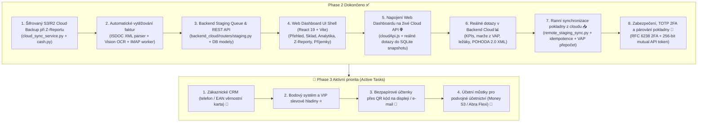
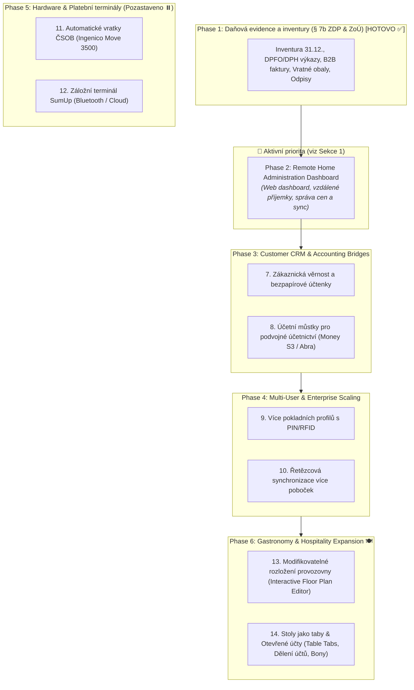

# VoltFlow POS — Master Product & Architecture Roadmap

_Last updated: September 2026_  
_Status: Active Living Document_  
_Architecture: Hybrid Offline-First Desktop (Tauri v2 + FastAPI + SQLite + React 19)_  
_Primary Target: Mixed Retail & Convenience Store (Smíšené zboží / Večerka / OSVČ) with Gastronomy & Bistro Extension_

---

## 1. Immediate Active Priorities (Nejbližší úkoly k realizaci) 🎯

Phase 1 (**Daňová evidence a inventury pro OSVČ**), **Kompletní Backend Audit (P0–P3)** i **Phase 2: Remote Home Administration Dashboard & Owner Back-Office** jsou **100 % dokončeny** ✅.  
Jedinou a hlavní aktivní prioritou pro realizaci je nyní **Phase 3: Customer CRM & Accounting Bridges (Zákaznický systém & Účetní můstky)**.

### 1.1 🌐 Web Dashboard pro vzdálenou správu z domova (*Phase 2 — 100 % HOTOVO ✅*)
- **Dokončeno (Completed ✅)**:
  - **Automatický cloud backup při uzávěrce**: Při provedení Z-Reportu na pokladně se spustí asynchronní záloha a upload šifrovaného snapshotu `pos_store.db` na S3/R2 úložiště.
  - **Pipeline automatického vytěžování faktur**: Nativní ISDOC XML parser (`isdoc_parser.py`), Vision OCR fallback pro papírové fotky/skeny (`ocr_service.py`) a IMAP poller e-mailu `faktury@obchod.cz`.
  - **Staging fronta dokladů**: Databázové moduly a REST endpointy pro schvalování, úpravy a správu příjemek (`backend_cloud/routers/staging.py`).
  - **Frontend UI kostra**: Aplikace `web/` v React 19 + Vite s 6 hlavními obrazovkami a Docker kontejnerem pro Home Server.
  - **Napojení UI na živé API**: Výměna statických mock konstant v `web/src/pages/` za dynamický HTTP klient `cloudApi.js` (Overview, Catalog s přidáváním produktů a změnou cen, Analytics, Z-Reports, Tax Exports, Intake).
  - **Reálné analytické a přehledové dotazy**: `SnapshotService` s `mode=ro&immutable=1` nad `pos_store.db` (tržby, marže dle VAP, ležáky, heatmapa, POHODA 2.0 XML).
  - **Ranní synchronizační klient na pokladně**: Klientský modul v pokladně (`backend/services/remote_staging_sync.py`), který při startu a každých 15 minut stáhne `GET /api/v1/staging/pending`, promítne nové produkty, změny cen a příjemky do skladových zásob (vč. VAP přepočtu dle § 25 ZoÚ), chrání idempotenci přes `applied_sync_events` a odešle `POST /api/v1/staging/ack`.
  - **Zabezpečení & TOTP 2FA**: Dvoufaktorové přihlášení (RFC 6238 TOTP) v `auth.py` a validace 256-bitového párovacího tokenu pokladny na staging endpointech.

---

## 2. Strategic Expansion Phases (Střednědobý a dlouhodobý plán) 🚀

*Target Profile: Small Retailers, Sole Proprietors (OSVČ / Večerky / Smíšené zboží) needing autonomous tax compliance, cash control, and home back-office administration without expensive external accounting software.*

---

### Phase 2: Remote Home Administration Dashboard & Owner Back-Office 🌐 (Aktivní priorita)

*Rationale: Shop owners spend all day at the counter serving customers. In the evening or from home, they need a dedicated web portal on their home PC/laptop/phone to manage accounting, enter invoices, inspect stock, and adjust prices without disturbing counter operations.*

#### 1. Web Dashboard pro vzdálenou správu z domova (*Vzdálená správa*)
- **Vzdálený přehled tržeb a marží**: Živý i historický přehled denních tržeb, platebních metod, marží a archivovaných Z-Reportů.
- **Zadávání příjemek z domova**: Majitel pohodlně na notebooku naťuká faktury od dodavatelů s ARES vyhledáváním a nahráním fotky/PDF dokladu. Automatická synchronizace na pokladnu v obchodě.
- **Vzdálená správa katalogu a cenotvorby**: Změna prodejních cen, správa dlaždic a sledování skladových zásob.
- **Exporty daňových podkladů z domova**: Stažení knihy příjmů a výdajů, přiznání k DPH a DPFO přílohy č. 1.
- **Architektura & Bezpečnost**: Využívá existující šifrovaný sync engine (`cloud_sync_service.py` / S3 / R2), 2FA přihlášení majitele.

---

### Phase 3: Zákaznický systém & Účetní můstky pro s.r.o.

#### 2. Zákaznická věrnost a bezpapírové účtenky
- CRM zákazníků (telefonní číslo / čárový kód věrnostní kartičky).
- Bodový systém a VIP slevové hladiny.
- Bezpapírová účtenka přes QR kód na zákaznickém displeji nebo odeslání na e-mail.

#### 3. Rozšířené účetní můstky (Podvojné účetnictví pro s.r.o.)
- POHODA 2.0 XML bridge je již hotov ✅.
- Rozšíření o exportní můstky pro: **Money S3**, **Abra Flexi (REST / XML)**, a **Helios Inuvio**.

---

### Phase 4: Multi-User Scaling, Řetězce & SaaS (Backlog)

#### 4. Více pokladních profilů s PIN/RFID (RBAC)
- Přepínání pokladních mezi prodeji (<1s) bez restartu aplikace.
- Role: `Pokladní`, `Vedoucí směny`, `Majitel`, `Účetní`.
- Sledování tržeb a hotovosti v zásuvce per pokladní.

#### 5. Multi-Store řetězcová synchronizace
- Lokální pokladny běží offline na SQLite; asynchronně synchronizují do centrální cloudové databáze.
- Centrální katalog zboží, sdílené ceny, přehled skladů napříč pobočkami.

---

### Phase 5: Hardware & Platební terminály (Backlog — Pozastaveno z důvodu chybějícího HW ⏸️)

*Praktické překážky pro realizaci: V současnosti není k dispozici kompatibilní bankovní terminál pro testování storen ani Bluetooth rozhraní / BLE adaptér na pokladním PC.*

#### 6. 💳 Automatické vratky platební kartou na terminál ČSOB (ČSOB Terminal Automated Reversals / Refunds)
- **Status**: ⏸️ Pozastaveno (není k dispozici kompatibilní bankovní terminál pro živé testování storno protokolu).
- **Scope**: Automatické odeslání storno příkazu na Ingenico Move 3500 terminál přes TCP socket (`POST /api/v1/payments/card-refund`).
- **Workflow**: Zahájení vratky v historii prodejů -> výzva terminálu "Přiložte kartu pro vrácení" -> zákazník přiloží kartu -> terminál vrátí autorizační kód (`RRN`/`AuthCode`) -> vytištění storno dokladu s referencí na terminál.

#### 7. 📶 Záložní terminál SumUp (SumUp Air / Solo Integration)
- **Status**: ⏸️ Pozastaveno (pokladní PC nedisponuje vestavěným Bluetooth ani USB BLE adaptérem).
- **Scope**: Připojení pokladny k SumUp Bluetooth a Cloud REST API jako levná bezdrátová alternativa platebního terminálu pro stánkový prodej nebo záložní zpracování karet.
- **Workflow**: Výběr "Karta" se zapnutým SumUp odešle platbu do spárované čtečky; pokladna čeká na potvrzení přes polling/webhook a automaticky uzavře prodej.

---

### Phase 6: Gastronomy & Hospitality Expansion 🍽️ (Gastro režim: Plán stolů a otevřené účty)

*Target Profile: Cafés, Bistros, Pubs, Restaurants, and Hybrid Retail Stores with Seating (Kavárny, bistra, hospody, gastro provozy a smíšené prodejny s posezením) needing flexible table management, open tabs, split bills, and interactive floor plans.*

#### 8. 🗺️ Modifikovatelné rozložení provozovny (Interactive Floor Plan & Table Editor)
- **Zóny a místnosti provozovny (Room Zones)**:
  - Podpora více nezávislých zón a prostorů (např. *Hlavní sál*, *Bar / Výčep*, *Zahrádka / Terasa*, *Salónek*).
  - Přepínání mezi místnostmi jedním kliknutím/dotykem.
- **Vizuální editor rozložení stolů (Floor Plan Canvas & Grid Editor)**:
  - Interaktivní plátno s drag & drop umisťováním stolů s volitelným magnetickým zarovnáním k mřížce (snap-to-grid).
  - Nastavitelné tvary stolů: čtverec, obdélník, kruh.
  - Nastavitelná velikost, orientace (rotace po 45°/90°) a kapacita míst k sezení (počet židlí).
  - Vlastní číslování a pojmenování stolů (např. *Stůl 1*, *Stůl 2*, *Bar 1*, *Zahrada 4*).
  - Zámek editace chráněný Admin PINem (prevence nechtěného posunu stolů obsluhou během běžného provozu).

#### 9. 📑 Stoly jako nastavitelné taby a otevřené účty (Table Tabs & Open Bills)
- **Rychlé taby stolů v pokladně (Table Tabs Bar)**:
  - Horní lišta otevřených stolů v pokladním rozhraní pro okamžité přepínání účtů na 1 dotyk bez nutnosti opouštět pokladní okno a vracet se do mapy stolů.
  - Dynamické taby s názvem stolu, aktuální útratou a indikátorem stavu.
- **Vizuální indikátory stavu stolů a tabů (Table State Indicators)**:
  - *Volný (Free)*: Zelený / neutrální podkres, stůl je volný k usazení.
  - *Obsazený s útratou (Occupied)*: Modrý podkres s částkou útraty, počtem položek a časem od otevření účtu.
  - *Žádost o zaplacení (Payment Requested)*: Oranžový pulzující podkres pro prioritu personálu.
- **Operace s otevřeným účtem stolu**:
  - **Průběžné markování na stůl**: Postupné přidávání jídel a nápojů v průběhu návštěvy hostů.
  - **Dělení účtu (Split Bill)**: 1-tap rozdělení útraty (platba vybraných položek konkrétním hostem, rozdělení na rovné díly, kombinace hotovost/karta).
  - **Přesun a sloučení stolů (Transfer & Merge)**: Přesun položek mezi stoly nebo sloučení více stolů pro větší skupinu hostů.
  - **Bonovací tisk pro kuchyň a bar (Kitchen / Bar Orders)**: Tisk objednávkových bonů na dedikované tiskárny (kuchyňská tiskárna pro teplá jídla, barová tiskárna pro nápoje) přes síťový nebo USB ESC/POS tisk.

---

### Plán verzování a budoucích tagů (SemVer Tagging Plan) 🏷️

| Tag | Fáze / Milník | Hlavní obsah vydání | Status |
|---|---|---|---|
| **`v0.1.0`** | Baseline Core | Základní offline-first pokladna, Tauri v2 desktop shell, ESC/POS tisk, EET 2.0 SOAP engine. | ✅ Vydáno |
| **`v0.2.0`** | Phase 1 & Audit | Daňová evidence pro OSVČ (§ 7b ZDP), inventura k 31.12. (§ 29, 30 ZoÚ), vratné obaly, odpisy (§ 25 ZoÚ), váhové zboží, kompletní audit P0–P3 (FIN-C1, EET-C1 C14N, DB-C1). | ✅ Vydáno |
| **`v0.3.0`** | **Phase 2** | **Remote Home Admin Dashboard**: Šifrovaný Cloud Sync (S3/R2), webové rozhraní pro správu z domova, vzdálené zadávání příjemek z notebooku/mobilu, vzdálená úprava cen a sledování tržeb. | ✅ Dokončeno |
| **`v0.4.0`** | **Phase 3 (Aktivní)** | **CRM & Účetní můstky**: Zákaznická věrnost (kartičky, slevové hladiny), bezpapírové QR/e-mail účtenky, exportní můstky pro podvojné účetnictví (Money S3, Abra Flexi). | 🎯 **Další na řadě** |
| **`v0.5.0`** | Phase 4 | **Multi-User & Enterprise**: Rychlé přepínání pokladních profilů s PIN/RFID, oddělené zásuvky per pokladní, multi-store synchronizace více poboček s centrálním katalogem. | 📋 Plánováno |
| **`v0.6.0`** | Phase 5 | **Hardware & Platební terminály**: Automatické vratky na terminál ČSOB (Ingenico Move 3500 TCP storno), integrace SumUp čtečky (až bude k dispozici HW). | ⏸️ Pozastaveno |
| **`v0.7.0`** | **Phase 6** | **Gastronomy & Hospitality Expansion**: Modifikovatelné rozložení provozovny (Floor Plan Editor), stoly jako přepínatelné taby s otevřenými účty, dělení účtů (Split Bill), přesuny stolů a bonovací tisk do kuchyně/baru. | 📋 Plánováno |
| **`v1.0.0`** | **Production Store Pilot** | **První ostré nasazení**: Zmrazené databázové schéma, ověřený ostrý provoz na fyzické večerce / bistru, kompletní instalátor, zálohovací a obnovovací postupy, EET certifikace. | 🚀 Cíl |

*(Poznámka: Mezi verzemi se mohou objevit opravné patch tagy `v0.2.1`, `v0.3.1` atd. pro okamžité hotfixy nalezené při testování bez nových funkcí).*

---

## 3. Completed Baseline Capabilities & Archive (Dokončené funkce ✅)

Již implementované, plně ověřené a funkční moduly v systému VoltFlow POS:

### Pokladna, Ergonomie & Hardware ✅
- **1. Poslední účtenka: Rychlý dotisk a Storno (`Cart.jsx`)**:
  - Cart header quick chip `[🧾 Poslední: 145 Kč]`, 1-tap dotisk na termotiskárnu (<1s) a rychlé storno.
- **2. Kontrola ceny / Cenovka (`PriceCheckModal.jsx`)**:
  - `F2` / tlačítko na liště, okamžité ověření ceny a skladu naskenováním bez vložení do košíku.
- **3. 1-Tap Tisk účtenky v pokladně ("Účtenku nechci")**:
  - Volba `[ ⚡ Dokončit bez tisku ]` vs `[ 🖨️ Dokončit a vytisknout ]` v platebním okně.
- **4. Upozornění na nízké zásoby na dlaždicích (`PresetTileCard.jsx`)**:
  - Červený odznak `Vyprodáno` (0 ks) a oranžový `Zbývá N ks`.
- **5. Vlastní text v zápatí účtenky a otevírací doba**:
  - Nastavitelné řádky zápatí v konfiguraci prodejny, tisk na účtenkách.
- **6. Skenování účtenky pro rychlou vratku (`ReceiptReturnModal.jsx`)**:
  - Code128 čárový kód účtenky, automatické dohledání prodeje, ochrana proti přečerpání vratky.
- **7. Vážní čárové kódy z etiketovacích vah (`barcodeUtils.js`)**:
  - Automatické parsování EAN-13 kódů s prefixem `28` (cena) a `29` (hmotnost v gramech).
- **8. 2-sloupcové rozvržení & dotyková kalkulačka (`ManualKeypad.jsx`)**:
  - Rozvržení pro dlaždice (65–70 % šířky), parkování až 3 košíků (`ParkedCartsDrawer.jsx`), bankovková tlačítka 100–5000 Kč s mincovním rozkladem.
- **9. Desktop Core & Hardware**:
  - Tauri v2 Rust wrapper + FastAPI sidecar, ESC/POS 80/58mm tisk, RJ11 otevírání pokladní zásuvky, zákaznický WebSocket LCD displej, platební terminál ČSOB Ingenico Move 3500 přes TCP.
- **10. Fiskální soulad (České EET 2.0)**:
  - PKCS#12 (`.p12`) podpis, RSA-SHA256 PKP, SHA-1 BKP, SOAP dispečer a asynchronní offline fronta.

### Účetnictví, Hotovost, Daně & Sklad ✅
- **11. Pokladní kniha & Pohyby v zásuvce (`CashMovementModel`, `routers/cash.py`)**:
  - 1-tap záznam pohybů: **Vklad hotovosti** (Float In), **Výběr / Platba dodavateli** (Payout), **Odvod do trezoru** (Safe Drop).
  - Tisk formálních stvrzenek o pohybu hotovosti na termotiskárně.
- **12. Směnové uzávěrky X-Report a Z-Report (`ShiftSessionModel`, `ZReportModal.jsx`)**:
  - Průběžný náhled směny (X-Report).
  - Finální denní uzávěrka (Z-Report): zadání přepočítané fyzické hotovosti, automatický výpočet rozdílu (**Manko / Přebytek**), sekvenční číslování `Z-0001`, uzamčení tržeb a tisk pásky.
- **13. Skladová příjemka zboží s ARES (`StockIntakeModal.jsx`, `routers/stock.py`)**:
  - Hromadné naskladnění položek s nákupní cenou bez DPH, číslem dodacího listu/faktury a poznámkou.
  - Okamžité online ověření dodavatele v registru ARES dle IČO.
- **14. Skladová výdejka a Kniha zásob (`StockMovementModel`, `StockMovementLedgerModal.jsx`)**:
  - Automatický odpis zásob při každém prodeji na pokladně, automatické zpětné naskladnění při vratce.
  - Kompletní chronologický auditní deník skladových pohybů (`RECEIPT`, `SALE`, `RETURN`).
- **15. Účetní můstek Stormware POHODA 2.0 XML (`services/pohoda_export.py`)**:
  - 1-klik měsíční export vydaných faktur s rozpadem DPH 21 %, 12 %, 0 % a pokladních dokladů v oficiálním XML formátu dataPack.
- **16. Šifrovaná záloha do cloudu (`services/cloud_sync_service.py`)**:
  - Automatické šifrované S3 / Cloudflare R2 zálohy SQLite databáze s retencí a diagnostikou.
- **17. Váhové zboží a otevřená cena na pokladně (`WeightEntryModal.jsx`, `PresetModal.jsx`)**:
  - Zadávání hmotnosti na dotykovém numpadu s rychlou tárou (-5 g, -15 g), volbou jednotek (`kg`, `g`, `ks`), výpočtem ceny v reálném čase a tiskem přesného množství na účtenku.
  - Podpora otevřené ceny (Open Price) pro vážené i kusové položky bez nutnosti předchozí pevné cenotvorby.
- **18. Klouzavý vážený průměr (VAP) a Hlídač marže (`routers/stock.py`, `StockIntakeModal.jsx`, `SupplierPriceHistoryModal.jsx`)**:
  - Automatické přepočítávání VAP při každé příjemce (§ 25 ZoÚ), auditní chronologie nákupních cen dodavatelů a výstraha minimální marže dle nastavitelného přirážkového koeficientu ($k_{\text{marže}}$) s 1-klik aktualizací prodejní ceny.
- **19. Tisk regálových cenovek na termotiskárně (`BarcodeLabelModal.jsx`, `services/escpos_service.py`)**:
  - Generátor a tisk 80mm/58mm regálových cenovek se zvýrazněnou cenou, názvem, EAN čárovým kódem, jednotkovou cenou (Kč/kg, Kč/l) a datem platnosti přímo z modulu Sklad.
- **20. W3C Exclusive C14N kanonikalizace pro EET 2.0 (`services/eet_soap.py`)**:
  - Plná shoda s XML-DSig specifikací Finanční správy ČR pomocí standardizované C14N kanonikalizace SOAP zpráv.
- **21. Skladové odpisy, likvidační protokoly a normy úbytků (§ 25 ZoÚ / § 77, 78 ZDPH) (`StockWriteOffModal.jsx`, `routers/stock.py`, `services/escpos_service.py`)**:
  - Formální vyřazení zásob z důvodu exspirace, zkázy, rozbití nebo manka s automatickým posouzením daňové uznatelnosti dle procentuálních norem úbytků per kategorie.
  - Zápis `WRITE_OFF` pohybů do knihy zásob, sekvenční číslování protokolů `ODP-YYYY-XXXX` a tisk oficiálního likvidačního protokolu na termotiskárně s podpisovou kolonkou.
- **22. Fyzická inventura k 31.12. a vyrovnání rozdílů (§ 29, 30 ZoÚ) (`PhysicalInventoryModal.jsx`, `routers/stock.py`, `services/escpos_service.py`)**:
  - Skenování a přepočet položek do inventurního archu v reálném čase, automatické vyčíslení mank a přebytků.
  - 1-klik zúčtování a narovnání skladu zápisem `ADJUSTMENT` pohybů, uzamčení inventury k datu a tisk oficiálního inventurního protokolu s podpisovými řádky.
- **23. Daňové výkazy DPFO Příloha č. 1 a DPH přehled (§ 7b ZDP) (`TaxReportsModal.jsx`, `routers/reports.py`, `services/escpos_service.py`)**:
  - Oficiální podklady pro daňové přiznání k dani z příjmů fyzických osob (příjmy ze SVČ, nákup zásob, provozní režie, počáteční a konečné zásoby).
  - Měsíční/kvartální DPH přehled (výstupní DPH dle sazeb 21 %, 12 %, 0 % vs. vstupní DPH z příjemek).
  - Tisk souhrnů na termotiskárně + generování a tisk standardizovaného A4 daňového protokolu.
- **24. B2B Fakturace z pokladny s ARES ověřením (§ 29 ZoDPH) (`PaymentModal.jsx`, `ReceiptPreviewPaper.jsx`, `routers/sales.py`, `services/escpos_service.py`)**:
  - Režim firemní faktury při platbě s bleskovým ARES lookupem (<1s) názvu firmy a sídla dle IČO.
  - Sekvenční číslování faktur `FA-YYYY-XXXX`, tisk prodlouženého termálního daňového dokladu s rozpadem DPH i náhledem na obrazovce s možností A4 tisku.
- **25. Kniha zálohovaných vratných obalů (`DepositPackagingModal.jsx`, `routers/stock.py`, `services/escpos_service.py`)**:
  - Evidence pivních lahví a přepravek: naskladnění, vyplacené zálohy zákazníkům, odvoz do pivovaru a zůstatek na prodejně.
  - Protokol o výdeji zálohovaných obalů pivovaru s tiskem stvrzenky pro řidiče.
- **26. Server-side rekalkulace DPH — FIN-C1 (`routers/sales.py`)**:
  - Striktní přepočet a ověření základu daně a DPH per sazba na straně serveru (`Σ(base + vat) == totalAmount`) bránící zaokrouhlovacím neshodám a klientským anomáliím.
- **27. Kompletní Backend Audit Remediation & Hardening — P0 až P3 (`docs/backend_audit_2026-09-11.md`)**:
  - **P0**: W3C Exclusive C14N XML-DSig podpis (`EET-C1`), serverová DPH validace (`FIN-C1`).
  - **P1**: Atomické sekvence účtenek/faktur v prodejní transakci (`DB-C1`), UTC validace certifikátu EET (`EET-C2`), atomické SQL odečty zásob bez race conditions (`DB-H1`), migrace všech peněžních sloupců na `Numeric(10,2)` (`FIN-H1`).
  - **P2 / P3**: Ochrana proti odpojení tiskárny (`PRN-H1`), CP852/CP1258 kódování, exponenciální backoff daemonu EET (`EET-H2`), Pydantic validace sazeb DPH (`FIN-L1`), ochrana sítě a limit velikosti loga (`PRN-H3`), pokrývající index `ix_sales_timestamp` (`DB-L1`).

---

## 4. Dropped / Rejected Tasks ❌ (Do Not Recommend)

Explicitně analyzováno a zamítnuto pro ochranu před chybami pokladních a narušením skladové evidence:

- **⚡ Rychlé násobiče množství pro basy a kartony (Quick Multiplier Chips: 2×, 4×, 6×, 10×, 20×)**:
  - *Důvod*: Stávající multiplikace na numpadu (`N * scan` / `N * klik`) plně pokrývá hromadný nákup bez zbytečného zahlcení dotykové plochy.
- **🥖 Rychlý "Volný prodej" přímo s DPH (`+ 12% Potraviny`, `+ 21% Zboží`) bez vazby na sklad**:
  - *Důvod*: Prodej položek bez vazby na skladovou kartu porušuje zákonné požadavky na vedení knihy zásob (*Výdejka*); volné položky musí využívat předdefinované skupinové karty (*CustomItemModal* s kategorií).

---

## 5. Documentation & Active Implementation Plan

Aktivní technické specifikace pro realizaci:

- [`REMOTE_WEB_DASHBOARD_PLAN.md`](file:///c:/Users/micha/Documents/GitHub/pos-project-himmel/docs/plans/REMOTE_WEB_DASHBOARD_PLAN.md) — Kompletní architektura a prováděcí plán pro **Phase 2: Remote Home Administration Dashboard & Cloud Sync**.

*(Poznámka: Specifikace předchozích dokončených milníků z Phase 1 a Backend Auditu jsou archivovány v historii repozitáře a jejich funkční přehled je zaznamenán v [Sekci 3: Completed Baseline Capabilities & Archive](#3-completed-baseline-capabilities--archive-dokončené-funkce-).*
