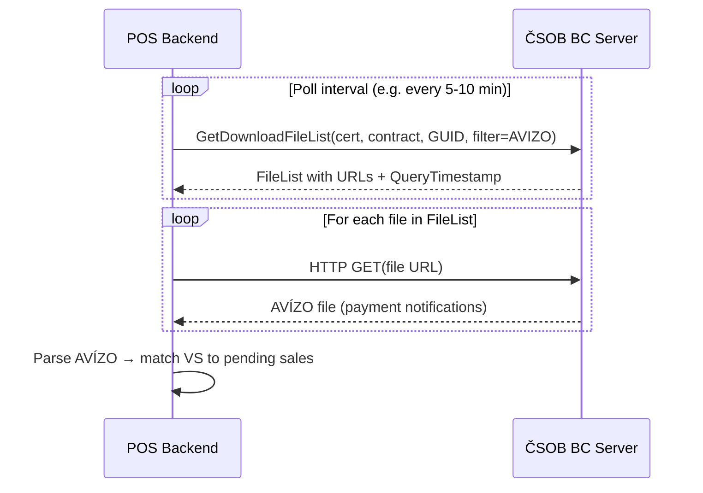

# ČSOB Business Connector — Incoming Payment Verification Summary

*Source: [csob-business-connector-implementacni-prirucka.pdf](file:///home/misko/Documents/pos-eet-himmel/docs/csob_docs/csob-business-connector-implementacni-prirucka.pdf)*
*Converted markdown: [csob-business-connector-implementacni-prirucka.md](file:///home/misko/Documents/pos-eet-himmel/docs/csob_docs/markdown/csob-business-connector-implementacni-prirucka.md)*

---

## Architecture Overview

ČSOB Business Connector (BC) is a **SOAP/HTTPS** web service for automated bank file exchange. It is **NOT a REST API** — it uses WSDL-defined SOAP operations with mutual TLS (client certificate) authentication.



> [!IMPORTANT]
> There is **no webhook/push notification** system. You must **poll** `GetDownloadFileList` periodically to discover new incoming payment files.

---

## Authentication Prerequisites

| Requirement | Detail |
|---|---|
| **Client Certificate** | X.509 from I.CA or PostSignum (or bank-issued). RSA ≥2048 bit, SHA256+. Must be registered in CEB portal. |
| **Contract Number** | Your CEB service contract number (`ContractNumber`) |
| **Client App GUID** | UUID identifying your POS installation (`ClientAppGuid`, format: `xxxxxxxx-xxxx-xxxx-xxxx-xxxxxxxxxxxx`) |
| **TLS** | Mutual SSL — min TLS 1.2, recommended TLS 1.3 |
| **SOAP** | SOAP 1.1 over HTTPS |

### Endpoints

| Environment | URL |
|---|---|
| **Production** | `https://ceb-bc.csob.cz/cebbc/api` |
| **Sandbox** | `https://testceb-bc.csob.cz/cebbc/api` |
| **WSDL** | `https://www.csob.cz/portal/documents/10710/15100026/cebbc-wsdl.zip` |

---

## Checking Incoming Payments — Step by Step

### Step 1: Call `GetDownloadFileList` (SOAP)

This is the **only** operation you need for reading incoming payments. It returns a list of available files from the bank.

#### Input Parameters

| Parameter | Required | Description |
|---|---|---|
| `ContractNumber` | ✅ | CEB service contract number |
| `ClientAppGuid` | optional | UUID of your app installation |
| `PrevQueryTimestamp` | optional | Timestamp from previous call — returns only **new** files since then |
| `Filter/FileTypes/FileType` | optional | **Set to `AVIZO`** to get only payment notifications |
| `Filter/FileFormats/FileFormat` | optional | Format: `XML`, `PDF`, `TXT`, `BBG` — use **`XML`** for machine processing |
| `Filter/CreatedAfter` | optional | Date filter (format: `YYYY-MM-DDTHH:MM:SS+ZZ:ZZ`) |
| `Filter/CreatedBefore` | optional | Date filter |
| `Filter/FileName` | optional | Specific filename |

> [!TIP]
> For incoming payment checking, always filter with `FileType = AVIZO` and `FileFormat = XML` to get only machine-readable payment notification files.

#### Output Parameters

| Parameter | Description |
|---|---|
| `QueryTimestamp` | Save this! Use as `PrevQueryTimestamp` in next call to get only new files |
| `FileList/FileDetail/Url` | URL to download the file (HTTP GET). May be empty if file is still being prepared (`Status = R`) |
| `FileList/FileDetail/Filename` | Filename with extension |
| `FileList/FileDetail/Type` | `VYPIS` (statements), **`AVIZO`** (payment notifications), `KURZY` (exchange rates), `IMPPROT` (import protocols) |
| `FileList/FileDetail/Format` | File format |
| `FileList/FileDetail/Status` | `R` = retry (file being prepared), **`D`** = ready to download, `F` = permanent error |

### Step 2: Download AVÍZO Files

For each file where `Status = "D"`, do a simple **HTTP GET** on the provided URL:

```
GET {FileDetail/Url}
```

The URL is pre-authenticated (contains a token), so you just need your TLS client certificate.

### Step 3: Parse AVÍZO and Match Payments

The AVÍZO file contains incoming payment details. Parse it to extract:
- **Variable Symbol (VS)** — match to your receipt/order numbers
- **Amount** — verify payment amount matches the sale
- **Sender account** — customer's bank account
- **Date** — payment date

> [!NOTE]
> The exact AVÍZO file format specification is documented separately at [www.csob.cz/ceb](https://www.csob.cz/ceb). The BC implementation guide doesn't include the file format itself.

---

## Polling Strategy

```
┌─────────────────────────────────────────────┐
│ INITIAL CALL                                │
│ GetDownloadFileList(filter=AVIZO)            │
│ → save QueryTimestamp                       │
├─────────────────────────────────────────────┤
│ SUBSEQUENT CALLS (every 5-10 min)           │
│ GetDownloadFileList(                         │
│   PrevQueryTimestamp = saved timestamp,     │
│   filter = AVIZO                            │
│ )                                           │
│ → returns only NEW files since last check   │
│ → save new QueryTimestamp                   │
├─────────────────────────────────────────────┤
│ If file Status = "R" (preparing):           │
│ → retry with SAME PrevQueryTimestamp        │
│                                             │
│ If file Status = "D" (ready):               │
│ → HTTP GET the URL, download & process      │
│                                             │
│ If file Status = "F" (failed):              │
│ → log error, don't retry                    │
└─────────────────────────────────────────────┘
```

> [!WARNING]
> **Rate limit**: Max **30 calls per 20 minutes** per contract+certificate pair. Error code `1101` if exceeded. Design your polling interval accordingly (minimum ~40 seconds between calls, realistically 5-10 minutes is sufficient).

---

## Error Codes

| Code | Meaning | Action |
|---|---|---|
| `1000` | General server error | Retry later |
| `1002` | Contract not authorized for BC | Check CEB portal settings |
| `1011` | Certificate not registered / contract doesn't exist or inactive | Register cert in CEB portal |
| `1012` | Certificate blocked | Unblock or replace certificate |
| `1101` | **Rate limited** — too many calls | Back off, wait ≥20 min |

### HTTP Status Codes (for file download)

| Status | Meaning | Action |
|---|---|---|
| 200/201 | OK | Process file |
| 400 | Missing params / file doesn't exist | Don't retry |
| 401 | Auth error | Check certificate |
| 403 | Unauthorized / URL expired | Don't retry |
| 408/500/502/503/504 | Timeout / server error | Retry |

---

## SOAP Request Template

Required HTTP headers:
```
Content-Type: text/xml; charset=utf-8
SOAPAction: "{operation from WSDL}"
Content-Length: {body length in bytes}
```

Minimal SOAP envelope for `GetDownloadFileList`:
```xml
<?xml version="1.0" encoding="utf-8"?>
<soap:Envelope xmlns:soap="http://schemas.xmlsoap.org/soap/envelope/"
               xmlns:ceb="...namespace from WSDL...">
  <soap:Body>
    <ceb:GetDownloadFileList>
      <ceb:ContractNumber>YOUR_CONTRACT</ceb:ContractNumber>
      <ceb:ClientAppGuid>YOUR-GUID-HERE</ceb:ClientAppGuid>
      <ceb:PrevQueryTimestamp>2026-08-01T00:00:00+02:00</ceb:PrevQueryTimestamp>
      <ceb:Filter>
        <ceb:FileTypes>
          <ceb:FileType>AVIZO</ceb:FileType>
        </ceb:FileTypes>
        <ceb:FileFormats>
          <ceb:FileFormat>XML</ceb:FileFormat>
        </ceb:FileFormats>
      </ceb:Filter>
    </ceb:GetDownloadFileList>
  </soap:Body>
</soap:Envelope>
```

> [!CAUTION]
> The exact XML namespace must come from the [WSDL file](https://www.csob.cz/portal/documents/10710/15100026/cebbc-wsdl.zip). Download it and check the `targetNamespace`.

---

## Implementation Checklist for POS Integration

- [ ] **Obtain client certificate** from I.CA or PostSignum (or request bank-issued)
- [ ] **Register certificate** in CEB portal for your contract
- [ ] **Enable AVÍZO downloads** in BC settings in CEB portal for target account(s)
- [ ] **Download WSDL** and extract exact namespaces/operations
- [ ] **Implement SOAP client** with mutual TLS using your .p12/.pfx certificate
- [ ] **Test against sandbox** (`testceb-bc.csob.cz`)
- [ ] **Implement polling loop** — call `GetDownloadFileList(filter=AVIZO)` every 5-10 min
- [ ] **Store `QueryTimestamp`** between calls for incremental polling
- [ ] **Download & parse AVÍZO XML** files
- [ ] **Match payments by Variable Symbol (VS)** to pending QR payment sales
- [ ] **Handle rate limiting** — respect 30 calls / 20 min limit
- [ ] **Handle file Status `R`** — retry with same timestamp until `D`
- [ ] **Log errors** with `TicketId` for bank support escalation

---

## Key Limitations

| Limitation | Detail |
|---|---|
| **No real-time push** | Polling only — minimum latency is your poll interval |
| **No individual payment query** | You get batch AVÍZO files, not per-transaction status |
| **Files have 45-day window** | `PrevQueryTimestamp` older than 45 days is ignored |
| **Only files generated while BC was enabled** | Historical files from before BC activation are not available |
| **AVÍZO format separate** | File structure spec is on csob.cz/ceb, not in this document |
