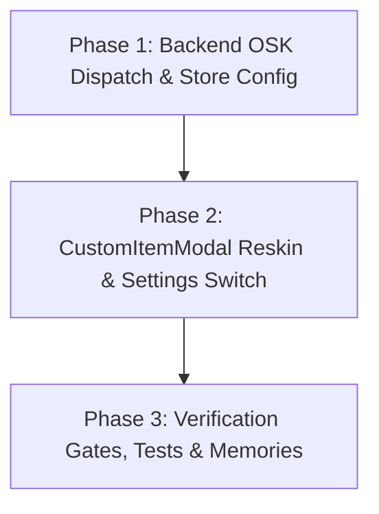

# VoltFlow POS — Keypad Modal Reskin & Windows Keyboard Invocation: Phased Plan & Quota Shield

## MCP Delegation Matrix

| Task Category | Tool / Model | Reason |
|---|---|---|
| **i18n Translations Drafting** | `openrouter_query` (`openai/gpt-oss-120b`) | Mechanical drafting across `cs`, `vi`, `en`. |
| **Backend Subprocess Mock Fixtures** | `openrouter_query` (`openrouter_code_refactor`) | Mock test fixtures for `backend/tests/test_system.py`. |
| **Core UI Reskin & Keyboard Wiring** | **Primary Context** | Surgical code edits, event listeners, component lifecycle. |
| **Verification & Gate Checks** | **Primary Context** | Running tests, build, lint, and Git commits. |

---

## Phased Execution Roadmap



---

## Phase 1: Backend OSK Dispatch, Config & i18n

### Scope:
- `backend/routers/system.py`: Add `POST /api/v1/system/open-keyboard` spawning `TabTip.exe` / `osk.exe` asynchronously with loopback security check.
- `src/api/posApi.js`: Add `openSystemKeyboard()`.
- `src/data/initialData.js`: Add `autoOpenTouchKeyboard: false` to `DEFAULT_STORE_CONFIG`.
- `src/i18n/translations.js`: Add `settings.touch_keyboard_title`, `settings.touch_keyboard_desc`, `custom_item.open_keyboard` across `cs`, `vi`, `en`.

---

## Phase 2: CustomItemModal Keypad-Modal Reskin & Settings Switch

### Scope:
- `src/components/CustomItemModal.jsx`:
  - Adopt exact `.modal-overlay` + `.modal-card` + `.modal-header` template from `OpenPriceModal.jsx`.
  - Top: Item name input with inline `[⌨️]` button (dispatches `posApi.openSystemKeyboard()` + `navigator.virtualKeyboard?.show()`), clear `✕` button, and retail tag pills (`Pečivo`, `Ovoce/Zel`, `Tiskoviny`, `Nealko`, `Ostatní`).
  - Stepper bar (`KeypadStepperBar`).
  - Amount readout card (`keypad-amount-display` with inline hold-backspace).
  - Czech VAT chips (`KeypadVatSelector`).
  - 4×4 Number Grid with single Enter action (`KeypadNumberGrid`).
  - Bottom `[Zrušit]` cancel button.
- `src/components/settings/LayoutSection.jsx`:
  - Add segmented/toggle control for "Automaticky otevřít dotykovou klávesnici Windows".

---

## Phase 3: Unit Tests, Verification Gates & Serena Memory

### Scope:
- `backend/tests/test_system.py`: Test `POST /api/v1/system/open-keyboard`.
- `src/__tests__/CustomItemModal.test.jsx`: Test modal rendering, keyboard button trigger, VAT, stepper, numpad, and cart submission.
- Full verification: `npm test`, `npm run lint`, `npm run build`, `python -m unittest discover -s backend/tests -p "test_*.py"`.
- Sync `.serena/memories/`.

---

# Copy-Paste Prompts for Isolated Conversations

### 📋 PROMPT FOR PHASE 1: Backend OSK Dispatch & Store Config

```markdown
<USER_REQUEST>
Execute PHASE 1 of the Keypad Modal Reskin & Windows Keyboard Plan in accordance with docs/plans/KEYPAD_MODAL_TOUCH_KEYBOARD_PLAN.md.

### Objectives:
1. Update `backend/routers/system.py`:
   - Add endpoint `POST /api/v1/system/open-keyboard` that verifies loopback caller and starts `TabTip.exe` (with fallback to `osk.exe`) in non-blocking background subprocess on Windows.
2. Update `src/api/posApi.js`:
   - Add `openSystemKeyboard()` calling `/api/v1/system/open-keyboard`.
3. Update `src/data/initialData.js`:
   - Add `autoOpenTouchKeyboard: false` to `DEFAULT_STORE_CONFIG`.
4. Delegate to OpenRouter MCP (`openrouter_query`) to draft translations in `src/i18n/translations.js` for:
   - `settings.touch_keyboard_title`, `settings.touch_keyboard_desc`, `custom_item.open_keyboard` (in `cs`, `vi`, `en`).
5. Insert translations into `src/i18n/translations.js` and verify with `npm run lint`.

Follow caveman response style.
</USER_REQUEST>
```

---

### 📋 PROMPT FOR PHASE 2: CustomItemModal Reskin & Settings Switch

```markdown
<USER_REQUEST>
Execute PHASE 2 of the Keypad Modal Reskin & Windows Keyboard Plan in accordance with docs/plans/KEYPAD_MODAL_TOUCH_KEYBOARD_PLAN.md.

### Objectives:
1. Update `src/components/CustomItemModal.jsx`:
   - Re-skin to exact layout from `OpenPriceModal.jsx`:
     - `.modal-overlay` + `.modal-card` + `.modal-header` (Tag/Calculator icon + title + close button).
     - Top: Item name input with inline `[⌨️]` button (calls `posApi.openSystemKeyboard()` + `navigator.virtualKeyboard?.show()`), clear button, and quick retail tags (`Pečivo`, `Ovoce/Zel`, `Tiskoviny`, `Nealko`, `Ostatní`).
     - `KeypadStepperBar` (-1, 1×, +1).
     - `keypad-amount-display` with inline hold-backspace button.
     - `KeypadVatSelector` (21%, 12%, 0%).
     - `KeypadNumberGrid` (4×4 grid + single `Přidat do Košíku` / `↩️ Vložit Vratku` Enter key).
     - Bottom `[Zrušit]` button.
2. Update `src/components/settings/LayoutSection.jsx`:
   - Add toggle for `storeConfig.autoOpenTouchKeyboard` under Ergonomie a Klávesnice.
3. Verify with `npm run lint`.

Follow caveman response style.
</USER_REQUEST>
```

---

### 📋 PROMPT FOR PHASE 3: Full Verification Gates & Serena Memory

```markdown
<USER_REQUEST>
Execute PHASE 3 of the Keypad Modal Reskin & Windows Keyboard Plan in accordance with docs/plans/KEYPAD_MODAL_TOUCH_KEYBOARD_PLAN.md.

### Objectives:
1. Update `backend/tests/test_system.py` and `src/__tests__/CustomItemModal.test.jsx`.
2. Run all verification gates:
   - `npm test`
   - `npm run lint`
   - `npm run build`
   - `python -m unittest discover -s backend/tests -p "test_*.py"`
3. Update `.serena/memories/frontend/components.md`.
4. Commit changes with clean Conventional Commit.

Follow caveman response style.
</USER_REQUEST>
```
