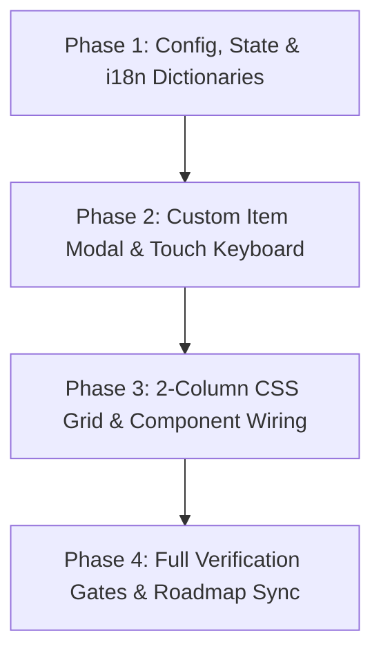

# VoltFlow POS — 2-Column Wide Presets Redesign: Phased Execution Plan & Quota Shield

## Strategy & Quota Shield Protocol

To preserve primary model quota and prevent weekly limit exhaustion, this implementation is partitioned into **4 isolated phases**. Each phase is fully decoupled and can be launched in a **fresh conversation thread**.

### MCP Delegation Matrix

| Task Category | Tool / Model | Reason |
|---|---|---|
| **i18n Dictionary Drafting** | `openrouter_query` (`openai/gpt-oss-120b` or `meta-llama/llama-3.3-70b-instruct`) | Pure mechanical translation and dictionary keys across `cs`, `vi`, `en`. |
| **Virtual Keyboard Layout & Mock Data** | `openrouter_query` or `ollama_quick_query` | Mechanical JSX array layout for QWERTY rows and Czech diacritics. |
| **Test Fixtures & Boilerplate** | `openrouter_query` (`openrouter_code_refactor`) | Mock props and repetitive test assertions. |
| **Core UI Wiring & State Math** | **Primary Antigravity Context** | Financial precision (`roundCZK`), VAT calculation, cart operations, surgical code edits. |
| **Verification & Gate Checks** | **Primary Antigravity Context** | Running tests, build, lint, and Git commits. |

---

## Phase Overview



---

## Phase 1: Configuration, State & i18n Dictionaries

### Scope
- Extend `DEFAULT_STORE_CONFIG` in `src/data/initialData.js` with `registerLayout: 'two_column'` (`'two_column'` | `'three_column'`).
- Ensure `shiftWidgetPosition` supports `'bottom_presets'`, `'under_cart'`, `'keypad'`.
- Update `src/components/settings/LayoutSection.jsx` with a segmented switch for **Rozvržení pokladny** (`2 sloupce — Široký sortiment` vs `3 sloupce — Klasická klávesnice`).
- Add comprehensive translations to `src/i18n/translations.js` across `cs`, `vi`, `en`.

### Task Delegation
- **OpenRouter MCP**: Delegate drafting i18n dictionary additions for `settings.register_layout_mode`, `settings.layout_two_column`, `settings.layout_three_column`, `custom_item.*`, `virtual_keyboard.*`.
- **Primary Agent**: Surgically update `initialData.js`, `LayoutSection.jsx`, and `translations.js`. Run `npm run lint`.

---

## Phase 2: On-Screen Touch Keyboard & Custom Item Modal

### Scope
- Create `src/components/CustomItemModal.jsx` and sub-components (or integrated touch keyboard):
  - Large touch numpad with fast amount shortcuts (`100`, `200`, `500`), decimal `.`, `Backspace`, `Clear`, and `±` return toggle.
  - VAT rate selector chips (`21% Zboží`, `12% Potraviny`, `0% Osvobozeno`).
  - Item description input field with clear button.
  - **On-Screen Touch QWERTY Keyboard** (`[⌨️ Klávesnice]` toggle):
    - Ergonomic touch keyboard with Czech character bar (`ěščřžýáíéúů`) and common retail quick chips (`Pečivo`, `Ovoce/Zel`, `Tiskoviny`, `Nealko`, `Ostatní`).
    - Minimum 44px touch targets for pure touchscreen POS terminals.
  - Adds custom item directly to cart upon submit.
- Write unit tests in `src/__tests__/CustomItemModal.test.jsx`.

### Task Delegation
- **OpenRouter / Ollama MCP**: Draft keyboard character layout arrays and initial test fixtures.
- **Primary Agent**: Build `CustomItemModal.jsx`, ensure VAT calculation accuracy, wire to cart, run `npm test -- src/__tests__/CustomItemModal.test.jsx`.

---

## Phase 3: 2-Column CSS Grid & Register Wiring

### Scope
- Update `src/App.jsx` layout container:
  - When `storeConfig.registerLayout === 'two_column'` (Default): Render 2 columns — **Presets Grid (~65–70% width)** and **Cart Column (~30–35% width)**.
  - When `storeConfig.registerLayout === 'three_column'`: Render classic 3 columns (`ManualKeypad` + `QuickPresetGrid` + `Cart`).
- In `src/components/QuickPresetGrid.jsx`:
  - Add `[🔢 Vlastní položka]` button to the preset toolbar opening `CustomItemModal`.
  - Support auto-expanding 4–6 columns for wide layouts.
- In `src/components/Cart.jsx`:
  - Ensure `ParkedCarts` is cleanly integrated via header chip `[⏸️ Odložit / Obnovit (N)]`.
  - Support docking `ShiftStatsWidget` in cart column or bottom of presets.
- Update `src/index.css` with responsive rules for `.layout-two-column`.

### Task Delegation
- **OpenRouter MCP**: Draft CSS styles for `.pos-layout.layout-two-column` and responsive media queries.
- **Primary Agent**: Wire components in `App.jsx`, `QuickPresetGrid.jsx`, `Cart.jsx`, and `index.css`. Run component tests.

---

## Phase 4: Verification Gates, Roadmap & Serena Memory

### Scope
- Run full frontend test suite: `npm test`
- Run frontend linter: `npm run lint`
- Run frontend production build: `npm run build`
- Run backend unit tests: `python -m unittest discover -s backend/tests -p "test_*.py"`
- Update `docs/ROADMAP.md` to reflect 2-Column Wide Presets & On-Screen Touch Input under verified capabilities.
- Sync `.serena/memories/` if applicable.

---

# Copy-Paste Prompts for New Conversations

Below are the exact, self-contained prompts to paste into a new conversation for each phase.

---

### 📋 PROMPT FOR PHASE 1: Config, State & i18n Dictionaries

```markdown
<USER_REQUEST>
Execute PHASE 1 of the 2-Column Wide Presets POS Redesign in accordance with docs/plans/PHASED_POS_REDESIGN_PLAN.md.

### Objectives:
1. Update `src/data/initialData.js`:
   - Add `registerLayout: 'two_column'` (valid values: `'two_column'`, `'three_column'`) to `DEFAULT_STORE_CONFIG`.
   - Ensure `shiftWidgetPosition` default is compatible (`'bottom_presets'` | `'under_cart'` | `'keypad'`).
2. Delegate to OpenRouter MCP (`openrouter_query`) to draft the i18n translation dictionary entries for `cs`, `vi`, and `en` in `src/i18n/translations.js` for:
   - `settings.register_layout_title`, `settings.register_layout_desc`
   - `settings.layout_two_column`, `settings.layout_two_column_desc`
   - `settings.layout_three_column`, `settings.layout_three_column_desc`
   - `custom_item.title`, `custom_item.price_label`, `custom_item.name_label`, `custom_item.name_placeholder`, `custom_item.vat_label`, `custom_item.add_to_cart`, `custom_item.keyboard_toggle`
   - `custom_item.quick_tags` (Pečivo, Zelenina/Ovoce, Tiskoviny, Nealko, Ostatní)
3. Surgically insert the drafted translations into `src/i18n/translations.js`.
4. Update `src/components/settings/LayoutSection.jsx`:
   - Add a segmented control under "Ergonomie a Rozvržení Pokladny" for "Rozvržení pokladny (Layout)" allowing selection between `2 sloupce (Široký sortiment)` and `3 sloupce (Klasická klávesnice)`.
   - Add placement option for Shift Summary Widget (`Pod sortimentem`, `Pod košíkem`, `Na klávesnici`).
5. Verify changes with `npm run lint`.

Follow caveman response style and poncho/ponytail build discipline. Report exact edits and lint status.
</USER_REQUEST>
```

---

### 📋 PROMPT FOR PHASE 2: Custom Item Modal & On-Screen Touch Keyboard

```markdown
<USER_REQUEST>
Execute PHASE 2 of the 2-Column Wide Presets POS Redesign in accordance with docs/plans/PHASED_POS_REDESIGN_PLAN.md.

### Objectives:
1. Create `src/components/CustomItemModal.jsx`:
   - Dedicated modal for uncataloged manual item entry when in 2-column mode or without physical keyboard.
   - **Price Input & Large Touch Numpad**: 100, 200, 500 Kč banknote quick chips, decimal `.`, Backspace, Clear, and `±` return toggle.
   - **VAT Rate Selector**: 21% (Zboží), 12% (Potraviny), 0% (Osvobozeno).
   - **Quantity / Multiplier Stepper**: `1×`, `2×`, `3×`, `5×`, `10×` or `+`/`-`.
   - **Item Description Input**: Text field with clear button.
   - **On-Screen Touch QWERTY Keyboard** (`[⌨️ Klávesnice]` toggle):
     - Touch keyboard with Czech characters (`ěščřžýáíéúů`) and quick retail suggestion chips (`Pečivo`, `Ovoce/Zel`, `Tiskoviny`, `Nealko`, `Ostatní`).
     - Min 44px touch targets, high contrast, responsive touch ergonomics.
   - **Submit**: Calls `onAddToCart` with normalized item object `{ id, name, price, vat, quantity, isCustom: true }` and closes modal.
2. Delegate drafting of the keyboard row matrix and test fixtures to OpenRouter MCP (`openrouter_query`).
3. Create unit tests in `src/__tests__/CustomItemModal.test.jsx`:
   - Tests price entry via numpad, VAT tier toggle, typing name via on-screen keyboard, and submitting to cart.
4. Run tests: `npm test -- src/__tests__/CustomItemModal.test.jsx` and verify 100% pass.

Follow caveman response style.
</USER_REQUEST>
```

---

### 📋 PROMPT FOR PHASE 3: 2-Column CSS Grid & Component Wiring

```markdown
<USER_REQUEST>
Execute PHASE 3 of the 2-Column Wide Presets POS Redesign in accordance with docs/plans/PHASED_POS_REDESIGN_PLAN.md.

### Objectives:
1. Update `src/App.jsx`:
   - Check `storeConfig?.registerLayout || 'two_column'`.
   - When `'two_column'`: Render 2 columns:
     - Left (or center): Presets Grid column (`pos-col-presets`, ~65–70% flex width).
     - Right: Cart column (`pos-col-cart`, ~30–35% flex width).
     - Do not render stationary `ManualKeypad` in 2-column mode.
   - When `'three_column'`: Render classic 3 columns (`pos-col-left` keypad + `pos-col-center` presets + `pos-col-right` cart).
2. Update `src/components/QuickPresetGrid.jsx`:
   - Add `[🔢 Vlastní položka]` action button to the preset toolbar.
   - Open `CustomItemModal` on click or shortcut.
   - Support auto-scaling 4–6 columns for wide layout screens.
3. Update `src/components/Cart.jsx` and widget placements:
   - Ensure Parked Carts (`ParkedCartsDrawer` / restore chip) is accessible from Cart header / footer in 2-column mode.
   - Support rendering `ShiftStatsWidget` docked under the presets column or under the cart footer based on `storeConfig.shiftWidgetPosition`.
4. Update `src/index.css`:
   - Add styles for `.pos-layout.layout-two-column` (grid/flex structure, height: 100dvh, no horizontal scroll, touch ergonomics).
5. Run existing and updated tests:
   - `npm test -- src/__tests__/keypad_cart_presets.test.jsx`
   - `npm test -- src/__tests__/App.test.jsx`

Follow caveman response style.
</USER_REQUEST>
```

---

### 📋 PROMPT FOR PHASE 4: Full Verification Gates & Documentation Sync

```markdown
<USER_REQUEST>
Execute PHASE 4 of the 2-Column Wide Presets POS Redesign in accordance with docs/plans/PHASED_POS_REDESIGN_PLAN.md.

### Objectives:
1. Run all mandatory verification gates:
   - `npm test` (all frontend tests must pass)
   - `npm run lint` (0 lint errors)
   - `npm run build` (successful production build)
   - `python -m unittest discover -s backend/tests -p "test_*.py"` (all backend tests must pass)
2. Update `docs/ROADMAP.md`:
   - Add 2-Column Wide Presets & On-Screen Touch Input to Section 1 (Existing Verified Capabilities) or Section 2.
   - Note how preset-first checkout enforces stock ledger integrity for Phase 1 OSVČ Accounting.
3. Update Serena memories in `.serena/memories/` if UI component signatures or store config schema changed.
4. Prepare clean Conventional Commit message.

Follow caveman response style.
</USER_REQUEST>
```
