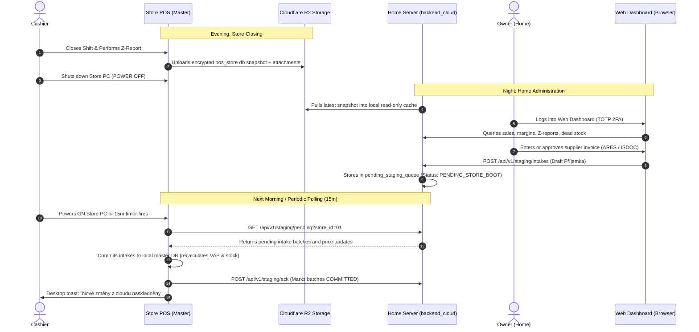

# VoltFlow POS — Phase 2: Remote Home Administration Dashboard & Cloud Sync Plan

_Document: Master Architecture & Implementation Specification_  
_Status: Approved for Implementation_  
_Target Release: v0.3.0_  
_Target Architecture: Monorepo + Hybrid Offline-First POS + 24/7 Home Server Container + Cloudflare R2 Sync_

---

## 1. Executive Summary & Problem Context

Shop owners (Večerka / Retail OSVČ) spend the entire day at the cash counter. In the evening or from home, they need a dedicated web dashboard on their laptop or mobile phone to:
1. Review real daily revenue, profit margins calculated from Weighted Average Purchase Price (VAP), cash drawer balance, and Z-Reports without disturbing register operations.
2. Enter stacks of supplier invoices (*Příjemky*) from Makro, Tamda, JIP, or breweries with automated ARES company lookup and invoice photo/PDF attachments.
3. Automatically ingest supplier invoices via email (`faktury@obchod.cz`) via Czech **ISDOC** XML and OCR vision fallback.
4. Adjust shelf prices from home and monitor dead stock or low inventory.
5. Export tax summaries (DPFO Příloha č. 1, DPH overview, POHODA 2.0 XML) for their accountant.

### Hardware & Power Reality
- **The Store PC is powered OFF at closing**.
- Direct tunneling to the store PC during the night is impossible.
- **Solution**: A **Master POS + Cloudflare R2 Replica + 24/7 Home Server + Staging Queue** architecture.

---

## 2. System Architecture & Data Flow

```
[STORE HOURS: POS OPEN]
Store PC (Master SQLite: pos_store.db)
       │
       ▼ (Auto-upload upon closing Z-Report or timer)
Cloudflare R2 Bucket (Encrypted AES-256 SQLite Snapshot + Attachments)
       │
       ▼ (Periodic fetch or instant read)
[HOME / CLOUD: 24/7 RUNTIME]
Home Server (FastAPI Container: `backend_cloud`)
  ├─ Reads replicated SQLite snapshot (read-only mode)
  ├─ Serves REST API for Home Web Dashboard
  ├─ IMAP Email Poller (fetches supplier invoices from `faktury@...`)
  └─ Manages `pending_staging_queue.db` (Invoices & Price adjustments)
       ▲
       │ HTTPS via Cloudflare Zero Trust Tunnel (`cloudflared`)
[OWNER AT HOME: LAPTOP / MOBILE]
Web Dashboard (`web/` React 19 + Vite app)
```



---

## 3. Hosting & Infrastructure Decisions

### V1 Target: 24/7 Home Server
- **Hardware**: Mini PC, Raspberry Pi, NAS, or home desktop running 24/7.
- **Container**: `backend_cloud` packaged as a standard lightweight Docker container (`python:3.11-slim`).
- **Network Exposure**: Cloudflare Zero Trust Tunnel (`cloudflared`).
  - **Zero open ports** on home router (no port forwarding).
  - **No static public IP** needed.
  - Free automatic SSL/TLS certificate with custom domain (`https://pos-admin.yourstore.cz`).
- **Operating Cost**: **\$0 / month** (leveraging existing hardware + free Cloudflare tiers).

### 3.2 Commercial Multi-Tenant Scale-Up Architecture

When expanding from a single personal store to a commercial SaaS serving hundreds of retailers:

#### 1. Database Model: Database-per-Tenant (Isolated SQLite)
- Rather than a shared multi-tenant database where query bugs can leak financial records:
  ```
  Cloud Storage (R2 / NVMe Server)
  ├── /tenants/
  │   ├── tenant_001_vecerka_praha/
  │   │   ├── pos_store.db          <── Encrypted replica of Store 1
  │   │   └── pending_staging_queue.db
  │   ├── tenant_002_potraviny_brno/
  │   │   ├── pos_store.db
  │   │   └── pending_staging_queue.db
  │   └── ...
  └── platform_master.db            <── Central users, subscriptions, pairing tokens
  ```
- **Physical Data Isolation**: Zero risk of cross-tenant data leaks.
- **GDPR Compliance**: Immediate, complete customer data deletion upon cancellation.
- **Multi-Branch Support**: Owners with multiple stores get a single login with a branch switcher dropdown (`[ Večerka Lipová ▾ ]`).

#### 2. Self-Service Onboarding (60-Second 6-Digit Pairing Flow)
- No technician or manual config file editing required:
  1. Owner creates account at `app.voltflow.cz` $\rightarrow$ clicks *"Přidat novou pokladnu"*.
  2. Web displays a 6-digit single-use pairing PIN: `[ 8 4 1 - 2 0 9 ]` (valid 15 mins).
  3. Cashier/Owner opens VoltFlow POS on register $\rightarrow$ Settings $\rightarrow$ Cloud Sync.
  4. Enters `841-209` $\rightarrow$ clicks *"Propojit"*.
  5. POS exchanges PIN with `backend_cloud` for a permanent encrypted 256-bit API Secret.
  6. Initial sync triggers automatically.

#### 3. SaaS Cost vs Revenue Economics

### 3.3 Hardware Requirements & Lightweight Resource Invariants

To guarantee the entire system runs smoothly on low-power hardware (Raspberry Pi / mini PC) with **< 60 MB RAM** and **< 1% CPU**:

#### 1. Hardware Specification Matrix

| Scale | Recommended Hardware | CPU | RAM | Storage | Est. Monthly Cost |
|---|---|---|---|---|---|
| **1 Store (Home Server)** | Raspberry Pi 4/5, Intel N100 mini PC, old laptop | 1–2 Cores | **1–2 GB** | 32–64 GB SSD | **0 Kč** (~30 Kč electricity) |
| **5–50 Stores (Scale-Up)** | 1× Hetzner Cloud VPS (CX22) or upgraded mini PC | 2 vCPU | **4 GB** | 40–80 GB NVMe | **~120 Kč / mo** (€4.50) |
| **500 Stores (Enterprise)** | 1× Hetzner Dedicated Server + Cloudflare R2 | 4–8 vCPU | **16 GB** | 256 GB NVMe | **~950 Kč / mo** (€38.00) |

#### 2. The 5 Lightweight Backend Invariants

1. **Zero Local AI/OCR on Home Server**:
   - Czech ISDOC parser uses Python stdlib `xml.etree.ElementTree` (**0.5 MB RAM, 2 ms execution**).
   - Scanned paper invoice fallback sends image to cloud Vision API (Gemini Flash / OpenRouter) via lightweight HTTP request. **Zero local GPU/CPU load**.
2. **SQLite `mode=ro&immutable=1`**:
   - Bypasses file locking entirely, direct memory-mapped read from OS page cache.
   - Query latency: **< 1 ms**, RAM overhead: **~10 MB**.
3. **Pre-Aggregated Z-Report JSON Summary**:
   - Store POS uploads a 4 KB summary (`z_summary_XXXX.json`) alongside the DB snapshot.
   - Dashboard loads daily/monthly metrics instantly in 2 ms without scanning 100,000 raw receipt rows.
4. **Self-Contained Static Streaming (FastAPI `StaticFiles`)**:
   - React frontend is built as a static bundle (`web/dist`).
   - Served directly by FastAPI via Starlette `StaticFiles` with streaming responses. **Zero Node.js runtime required on Home Server**.
5. **Ultra-Lean Docker Container (`python:3.11-slim`)**:
   - Total container image size: **< 130 MB**.
   - Idle RAM usage: **~35–45 MB**.

---

## 4. Web Dashboard Feature Specification

### 4.1 📊 Module 1: Executive Dashboard & Live Financials
- **KPI Summary Cards**:
  - Gross Revenue (Tržba s DPH) & Net Revenue (Bez DPH).
  - Realized Gross Profit (Hrubý zisk v Kč) & Margin % calculated from Weighted Average Purchase Price (VAP).
  - Basket stats: Total receipt count, Average Basket Value (AOV).
  - Cash Drawer Status: Balance in till at closing.
- **Payment Split**:
  - Breakdown: Cash (Hotovost), Card (Platba kartou), B2B Invoice (Faktura), Meal Vouchers (Stravenky).
- **Hourly Sales Curve**:
  - Bar chart showing transaction volume and revenue across store opening hours.
- **Heartbeat Status**:
  - Indicator: *"Poslední synchronizace: Dnes ve 20:02 při uzávěrce Z-0042"*.

### 4.2 📈 Module 2: Deep Analytics & Profit Intelligence
- **Top Profit Drivers vs Volume Drivers**:
  - Top 10 by pure CZK profit contribution vs Top 10 by revenue.
  - Identifies high-margin gems (energy drinks, snacks) vs low-margin traffic drivers (cigarettes).
- **Margin Erosion Alert (Silent Profit Leaks)**:
  - Table of products where recent supplier intake prices increased, but retail prices were not updated, dropping profit margin below threshold.
- **Dead Stock & Trapped Capital**:
  - Items with quantity $> 0$ but zero sales over 30 / 60 / 90 days.
  - Displays total frozen capital in CZK.
- **Rush-Hour Heatmap (7 Days $\times$ 24 Hours)**:
  - Density matrix for optimal cashier and restocking shift planning.
- **Loss & Shrinkage Tracker (Ztráty & Odpisy)**:
  - Monthly write-offs breakdown (Damage, Expired, Spoilage, Shrinkage).
  - Cumulative cashier cash variance (Manko / Přebytek).

### 4.3 📑 Module 3: Shift Sessions & Z-Report Archive
- **Z-Report Browser**:
  - Filterable table (`Z-0001`, `Z-0002`...).
  - Calculated cash vs Counted physical cash variance (Manko/Přebytek).
  - Digital Thermal Tape viewer: 1:1 visual replica of receipt printer strip.
- **Cash Movement Ledger (*Pokladní kniha*)**:
  - Chronological audit of manual drawer operations: Float In (Vklad), Payout (Výplata/Nákup), Safe Drop (Odvod do trezoru).
- **Anti-Theft & Fraud Indicators**:
  - Voided receipts count (*Storna*), applied discounts, and manual drawer kick events without sale.

### 4.4 📥 Module 4: Remote Supplier Intake (*Příjemky*) & Automated Fetching
- **Automated Email Intake Pipeline**:
  - Background IMAP worker on Home Server polls `faktury@obchod.cz`.
  - **ISDOC XML Parser**: Standard Czech electronic invoice format (Makro, JIP, POHODA, Alza). 100% mathematical precision, zero AI cost.
  - **Vision OCR Fallback**: LLM Vision parser for photographed paper invoices or standard PDFs.
  - Stages draft batches with status `PENDING_REVIEW`.
- **Manual Intake Form**:
  - Supplier search with instant ARES registry lookup by IČO.
  - Invoice Number, Issue Date, Due Date, attachment preview (photo/PDF).
  - Item grid: EAN barcode search, quantity, buy price without VAT, VAT tier.
  - Live Margin Calculator: Displays resulting margin based on existing retail price; 1-click button to bump retail price.
- **Staging Queue Lifecycle**:
  - `DRAFT` $\rightarrow$ `PENDING_STORE_SYNC` $\rightarrow$ `COMMITTED` (applied on POS).

### 4.5 🏷️ Module 5: Catalog & Price Management
- **Searchable Catalog**:
  - Product search by EAN, internal code, name, category, and VAT tier.
- **Price Adjustment Drawer**:
  - Edit retail price or margin multiplier.
  - Changes queued for POS boot.
- **Shelf Label Print Queue**:
  - When prices change from home, POS marks items for 1-click label printing on the ESC/POS printer next morning.

### 4.6 📑 Module 6: Tax & Accounting Hub
- **DPFO Příloha č. 1 (§ 7b ZDP)**:
  - Official summary of business income and tax-deductible expenses.
- **DPH Přehled (VAT Return Summary)**:
  - Monthly/quarterly input vs output VAT split by 21%, 12%, and 0% tiers.
- **Export Bridges**:
  - Stormware POHODA 2.0 XML (`dataPack` invoices and cash entries).
  - Downloadable/printable A4 PDF and CSV for external accountant.

### 4.7 📱 Module 7: PWA & UX Polish
- **Progressive Web App (PWA)**:
  - App manifest enables 1-tap "Add to Home Screen" on iOS/Android (native app feel, no URL bar).
  - Service Worker caches the last known SQLite snapshot and CSS/JS for instant load even on spotty mobile signal.
- **Dark Mode**:
  - CSS variable toggle for comfortable evening usage. Defaults to system preference.

---

## 5. Security, Stability & Failure Defense Architecture

### 5.1 Authentication & Access Control
1. **Owner Authentication**:
   - Username + bcrypt hashed password (work factor 12).
   - Time-based One-Time Password (TOTP 2FA, RFC 6238) via Google Authenticator / Apple Keychain.
   - HttpOnly + Secure + SameSite=Strict session cookies (immune to XSS and CSRF).
   - Rate limiting on login: 5 failed attempts $\rightarrow$ 15-minute lockout.
2. **Store POS Machine Pairing**:
   - Outbound-only HTTPS communication (store router requires zero open ports).
   - Authenticated via cryptographically generated 256-bit mutual API Secret stored in `StoreConfigModel`.
   - **Instant Device Revocation**: 1-click button in Web Dashboard to revoke compromised or stolen store registers.

### 5.2 The 7 Critical Safety & Stability Defenses

1. **Idempotency & Replay Defense (Preventing Double Stock Intake)**:
   - Every staged event (příjemka, price change) is assigned a client-generated UUID (`idempotency_key`).
   - Store POS tracks applied keys in `applied_sync_events` table with `UNIQUE(idempotency_key)`.
   - If network drops during ACK and cloud resends batch on next boot, POS detects duplicate key, skips application, and re-sends ACK without re-incrementing stock or skewing VAP.

2. **Snapshot Integrity & Atomic File Swap (Corruption Defense)**:
   - **SHA-256 Checksum**: Store POS computes hash before upload; cloud verifies match before unpacking.
   - **Integrity Verification**: Cloud executes `PRAGMA quick_check;` before mounting SQLite snapshot.
   - **Atomic Replacement**: Cloud extracts to temporary file (`pos_store.tmp.db`), verifies health, then performs atomic file swap via `os.replace`. The active database file is never overwritten in place.

3. **Stale Data Warning, Split-Brain Guard & Webhooks**:
   - Web dashboard calculates freshness: `delta = now() - snapshot_timestamp`.
   - If delta $> 2$ hours during operating hours, or if closing Z-Report is missing after 21:00:
     - Prominent amber banner warns owner: *"⚠️ Data jsou k 13:02. Poslední uzávěrka nebyla nahrána (zkontrolujte internet na prodejně)."*
     - Prevents making business decisions on incomplete numbers.
     - **Active Alerting**: Triggers simple Telegram Webhook (free) to ping owner immediately without needing to open the app.

4. **Concurrent Price Conflict Resolution (Store Register Authority)**:
   - Staged price changes include `expected_current_price` and `created_at`.
   - If cashier modified item price locally on the register *after* the home price was staged:
     - Register is authoritative: POS discards staged price, keeps register price, and logs conflict notification for cashier.

5. **Storage Quota & Automated Pruning (Disk Fill-Up Prevention)**:
   - Daily snapshots (10–20MB) accumulate quickly on Home Server / R2 storage.
   - Automated retention pruning rule in `cloud_sync_service.py`:
     - Keep all snapshots for last 7 days.
     - Keep daily snapshots for 30 days.
     - Keep monthly snapshots for 12 months.
     - Prune older intermediate files automatically.

6. **File Upload & Attachment Security (Invoice PDFs & Photos)**:
   - **Magic-Byte Sniffing**: Inspect binary file headers (reject mismatched extensions or disguised executables).
   - **Size Ceiling**: Strict 15 MB limit per attachment.
   - **Sanitized Paths**: Strip original filenames; store files as `{uuid4()}.pdf` or `{uuid4()}.jpg` (prevents path traversal attacks).

7. **Zero Open Ports & Egress-Only Communication**:
   - Store PC never opens incoming listening ports.
   - Home Server exposes port 8000 strictly through Cloudflare Zero Trust Tunnel (`cloudflared`).
   - Home router ports remain completely closed to the public internet.

### 5.3 Caching & Performance Architecture
To maintain the <1% CPU and <60MB RAM invariants, the system employs a 3-tier caching strategy:
1. **External API Cache (ARES)**: The Czech gov ARES registry aggressively rate-limits requests. The `ares_service` uses `lru_cache` to ensure repeated lookups for the same supplier (e.g., Makro IČO during a stack of 10 invoices) never hit the network twice.
2. **Heavy Analytics In-Memory Cache**: Queries like *Rush-Hour Heatmap* and *Top Profit Drivers* are computationally expensive. Since the read-only database only updates once a day (upon Z-Report upload), these endpoints use a Python `TTLCache`. Refreshing the dashboard yields 0ms database overhead.
3. **Static Asset Edge Caching**: FastAPI serves the React `web/dist` bundle with strict `Cache-Control: public, max-age=31536000, immutable` headers for JS/CSS assets, ensuring the browser/PWA never re-downloads unchanged UI code.

---

## 6. Monorepo Structure

```
pos-project-himmel/
├── backend/                   # Local Store POS Backend (FastAPI)
│   ├── models.py              # Shared SQLAlchemy models
│   ├── services/
│   │   ├── ares_service.py    # Shared ARES registry lookup
│   │   └── cloud_sync_service.py # S3/R2 upload & restore engine
│   └── routers/
│       └── ...
├── backend_cloud/             # 24/7 Home Server Cloud API (FastAPI)
│   ├── Dockerfile             # Multi-stage container definition
│   ├── docker-compose.yml     # Local orchestration on Home Server
│   ├── main.py                # Application entry point
│   ├── database.py            # Read-only snapshot loader + staging DB
│   ├── services/
│   │   ├── email_fetcher.py   # IMAP worker for faktury@...
│   │   ├── isdoc_parser.py    # Czech ISDOC XML parser
│   │   └── ocr_service.py     # Vision OCR parser fallback
│   └── routers/
│       ├── auth.py            # 2FA & JWT management
│       ├── dashboard.py       # Metrics, margins, and sales
│       ├── analytics.py       # Top profit, dead stock, heatmap
│       ├── staging.py         # Intake & price queues
│       └── exports.py         # POHODA & tax exports
├── src/                       # Local Desktop POS Frontend (React 19 + Tauri v2)
│   ├── styles/                # Master CSS Design Tokens (shared)
│   └── ...
├── web/                       # [NEW] Web Dashboard Frontend (React 19 + Vite)
│   ├── package.json
│   ├── vite.config.js
│   ├── src/
│   │   ├── App.jsx
│   │   ├── api/cloudApi.js
│   │   ├── pages/
│   │   │   ├── OverviewPage.jsx
│   │   │   ├── AnalyticsPage.jsx
│   │   │   ├── ZReportsPage.jsx
│   │   │   ├── IntakePage.jsx
│   │   │   ├── CatalogPage.jsx
│   │   │   └── TaxExportsPage.jsx
│   │   └── components/
└── docs/plans/
    └── REMOTE_WEB_DASHBOARD_PLAN.md # This document
```

---

## 7. Phased Implementation Roadmap

### Phase 2.1: Cloud Sync & Home Server Backend Foundation
- **Goals**:
  1. Complete automated SQLite snapshot upload in `backend/services/cloud_sync_service.py` upon Z-Report closure.
  2. Scaffold `backend_cloud/` container with read-only SQLite snapshot loader, mutual POS auth token, and TOTP 2FA.
  3. Provide `Dockerfile` and `docker-compose.yml` for Home Server deployment.
- **Verification**:
  - `python -m unittest discover -s backend/tests -p "test_cloud_sync*.py"`
  - `python -m unittest discover -s backend_cloud/tests -p "test_*.py"`

### Phase 2.2: Web Dashboard Shell & Read-Only Reporting
- **Goals**:
  1. Initialize `web/` React 19 + Vite application.
  2. Import design tokens from `src/styles/` for responsive desktop table + mobile card views.
  3. Implement Executive Dashboard KPI cards, Z-Report digital tape viewer, and Stock search.
- **Verification**:
  - `cd web && npm run test && npm run build`

### Phase 2.3: Deep Analytics & Shift/Tax Hub
- **Goals**:
  1. Implement Top Profit Drivers vs Dead Stock calculation.
  2. Implement 7x24 Rush-Hour Heatmap and Margin Erosion alerts.
  3. Add 1-click download of DPFO, DPH overview, and POHODA 2.0 XML from home.
- **Verification**:
  - Validate generated POHODA XML against actual POS export.

### Phase 2.4: Bi-Directional Staging Queue & Manual Intake with ARES
- **Goals**:
  1. Create `pending_staging_queue` in `backend_cloud`.
  2. Build Web Intake UI with ARES company lookup and live margin calculator.
  3. Add morning startup hook to Store POS: queries Home Server, pulls pending intakes, commits to master DB.
- **Verification**:
  - End-to-end staging and store pull test.

### Phase 2.5: Automated Invoice Fetching (Email IMAP + ISDOC + OCR)
- **Goals**:
  1. Build background IMAP worker on Home Server polling `faktury@obchod.cz`.
  2. Implement native Python ISDOC XML parser.
  3. Add Vision OCR parser fallback for paper photo scans.
  4. Show 1-click approval badge on Web Dashboard.
- **Verification**:
  - Test with mock Makro ISDOC file and scanned paper receipt.

---

## 8. Verification & Gate Checklist
Before marking Phase 2 as complete:
- [ ] Store POS offline tests pass: `python -m unittest discover -s backend/tests`
- [ ] Desktop POS frontend tests & build pass: `npm run test && npm run build`
- [ ] Cloud backend tests pass: `python -m unittest discover -s backend_cloud/tests`
- [ ] Web dashboard tests & build pass: `cd web && npm run test && npm run build`
- [ ] Full end-to-end simulation: Store Z-Report $\rightarrow$ R2 upload $\rightarrow$ Home server query $\rightarrow$ Remote intake $\rightarrow$ Next day POS pull.
