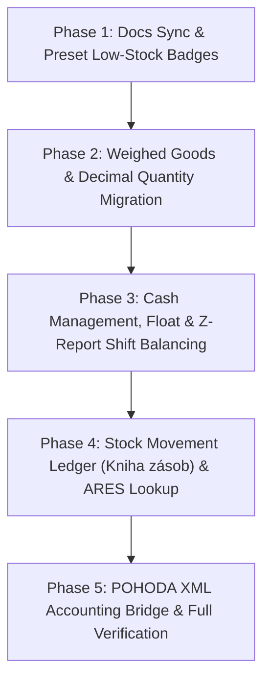

# VoltFlow POS — Master Roadmap Rework & Small Retailer Foundation

Implementation plan to execute the 5 phases defined in [`docs/plans/ROADMAP_REWORK_AND_FOUNDATION_PLAN.md`](file:///c:/Users/micha/Documents/GitHub/pos-project-himmel/docs/plans/ROADMAP_REWORK_AND_FOUNDATION_PLAN.md) using isolated branch execution (`phase-plan` protocol).

## User Review Required

> [!IMPORTANT]
> **Sequential Branch Execution & Approval**:
> Following `/phase-plan`, this design partitions the master roadmap into **5 isolated, verifiable phases**. Execution proceeds inside a clean isolated branch (`Workspace: 'branch'`). Upon approval of this plan, Phase 1 will be launched.

> [!WARNING]
> **Phase 2 Schema Migration**:
> `SaleItemModel.quantity` will migrate from `Integer` to `Float` in SQLite. All existing integer records will be converted safely to floats (`1` -> `1.0`).

> [!NOTE]
> **Accounting Compliance**:
> Phase 5 implements standard Stormware POHODA XML export packages for monthly sales & cash drawer slips, replacing proprietary accounting with standard accountant interchange.

---

## Phase Breakdown & Dependencies

---

## Proposed Changes

### Phase 1: Docs Sync & Preset Low-Stock Badges (Quick Win)

Align documentation and implement out-of-stock & low-stock badges on preset tiles.

#### [MODIFY] [TODO.md](file:///c:/Users/micha/Documents/GitHub/pos-project-himmel/TODO.md)
- Mark completed counter items as checked: 1-Tap Print on Demand, Thermal Shelf Price Tags, Custom Receipt Footer, 2-Column Wide Layout, Touch Custom Item Modal.
- Drop rejected/redundant items: Quick Multiplier Chips and Direct Volný Prodej keys (superseded by N*scan and CustomItemModal).
- Mark Low-Stock Badges on Presets as active.

#### [MODIFY] [PresetTileCard.jsx](file:///c:/Users/micha/Documents/GitHub/pos-project-himmel/src/components/presets/PresetTileCard.jsx)
- Read `trackStock` (`preset.trackStock ?? preset.track_stock`).
- If `trackStock` is true and `stockQuantity <= 0`: Render red pill badge (`Vyprodáno` / `0 ks`).
- If `trackStock` is true and `0 < stockQuantity <= (preset.minStockAlert ?? 5)`: Render amber pill badge (`Zbývá {count} ks`).
- Update React memo comparator (`arePresetCardPropsEqual`) to compare `trackStock`, `stockQuantity`, and `minStockAlert` so cards re-render when stock levels update.
- Ensure touch ergonomics: preserve >= 44px touch targets without obscuring preset name or price.

#### [MODIFY] [register.css](file:///c:/Users/micha/Documents/GitHub/pos-project-himmel/src/styles/register.css)
- Add CSS classes `.preset-stock-badge`, `.preset-stock-badge.out-of-stock`, and `.preset-stock-badge.low-stock`.

#### [MODIFY] [translations.js](file:///c:/Users/micha/Documents/GitHub/pos-project-himmel/src/i18n/translations.js)
- Add `presets.out_of_stock` ("Vyprodáno" / "Hết hàng" / "Out of stock") in `cs`, `vi`, `en`.
- Add `presets.low_stock` ("Zbývá {count} ks" / "Còn {count} cái" / "{count} left") in `cs`, `vi`, `en`.

#### [NEW] [PresetTileCard.test.jsx](file:///c:/Users/micha/Documents/GitHub/pos-project-himmel/src/__tests__/PresetTileCard.test.jsx)
- Unit tests verifying badge rendering for:
  - Untracked preset (no badge)
  - Tracked preset with normal stock (no badge)
  - Tracked preset with stock = 0 (red out-of-stock badge)
  - Tracked preset with stock <= alert threshold (amber low-stock badge)
  - Memo equality behavior

---

### Phase 2: Architectural Migration — Weighed Goods & Decimal Quantities

Support produce/deli scales, decimal quantities (kg), and variable-weight scale barcodes (EAN prefixes 28/29).

#### [MODIFY] [models.py](file:///c:/Users/micha/Documents/GitHub/pos-project-himmel/backend/models.py)
- Update `SaleItemModel.quantity` from `Column(Integer)` to `Column(Float, nullable=False, default=1.0)`.

#### [MODIFY] [migrations.py](file:///c:/Users/micha/Documents/GitHub/pos-project-himmel/backend/migrations.py)
- Add SQLite migration step to safely convert `sale_items.quantity` to `FLOAT` without data loss.

#### [MODIFY] [sales.py](file:///c:/Users/micha/Documents/GitHub/pos-project-himmel/backend/routers/sales.py)
- Ensure sales creation, inventory decrement, and refund calculations support decimal float quantities.

#### [MODIFY] [barcodeUtils.js](file:///c:/Users/micha/Documents/GitHub/pos-project-himmel/src/utils/barcodeUtils.js)
- Implement scale barcode parser for EAN-13 prefixes:
  - Prefix `28` (price-embedded): `28 + 5-digit SKU + 5-digit price in CZK`.
  - Prefix `29` (weight-embedded): `29 + 5-digit SKU + 5-digit weight in grams` (e.g., `00650` -> `0.650 kg`).

#### [MODIFY] Cart UI Components
- Format line quantities with appropriate unit display (`2 ks` vs `0.65 kg`).

#### [NEW] Tests
- `backend/tests/test_decimal_quantity.py`: Migration & decimal sale processing.
- `src/__tests__/barcode_scanner.test.jsx`: Unit tests for scale barcode prefixes 28 & 29.

---

### Phase 3: Cash Management, Float & Z-Report Shift Balancing

Cash drawer accountability, petty cash payouts, opening float, and end-of-shift Z-closures.

#### [MODIFY] [models.py](file:///c:/Users/micha/Documents/GitHub/pos-project-himmel/backend/models.py)
- Create `CashMovementModel`: `id`, `shift_id`, `movement_type` (`FLOAT_IN`, `PAYOUT`, `SAFE_DROP`), `amount`, `reason`, `created_at`.
- Create `ShiftSessionModel`: `id`, `shift_number`, `opened_at`, `closed_at`, `opening_cash`, `expected_cash`, `actual_cash`, `discrepancy`, `is_closed`, `z_seq`.

#### [NEW] `backend/routers/cash.py`
- Endpoints:
  - `POST /api/v1/cash/movement` (Vklad / Výběr)
  - `GET /api/v1/cash/current-shift`
  - `POST /api/v1/cash/close-shift` (Z-Uzávěrka)
  - `POST /api/v1/printer/print-z-report` (Thermal closure slip)

#### [NEW] Frontend UI
- `CashDrawerMovementModal.jsx`: 1-tap `[Vklad]` / `[Výběr]`.
- Connect to Bottom Action Dock in `ManualKeypad.jsx` and Navbar.
- `ZReportModal.jsx`: Shift count dialog with discrepancy calculation.
- i18n keys for cash movements and shift closures.

#### [NEW] Tests
- `backend/tests/test_cash_management.py`
- `src/__tests__/cash_shift.test.jsx`

---

### Phase 4: Stock Movement Ledger (Kniha zásob) & Czech ARES Lookup

Replace mutable stock counter with § 7b ZDP compliant stock ledger and fast supplier intake.

#### [MODIFY] [models.py](file:///c:/Users/micha/Documents/GitHub/pos-project-himmel/backend/models.py)
- Add `StockMovementModel`: `id`, `preset_id`, `movement_type` (`RECEIPT`, `SALE`, `RETURN`, `WRITE_OFF`, `ADJUSTMENT`), `quantity_delta`, `unit_cost`, `supplier_ico`, `supplier_name`, `document_ref`, `note`, `timestamp`.

#### [MODIFY] [sales.py](file:///c:/Users/micha/Documents/GitHub/pos-project-himmel/backend/routers/sales.py)
- Auto-record `SALE` and `RETURN` movements in ledger when sales are completed or refunded.

#### [NEW] `backend/routers/ares.py` (or router endpoint)
- `GET /api/v1/ares/lookup/{ico}`: Fetch legal company name, address, and DIČ from official Czech ARES REST API.

#### [NEW] Frontend UI
- `StockIntakeModal.jsx` (`Příjemka zboží`): Supplier IČO auto-fill via ARES, invoice reference, and batch quantity intake.
- Stock history tab in inventory management.

#### [NEW] Tests
- `backend/tests/test_ares_and_stock_ledger.py`
- `src/__tests__/inventory_intake.test.jsx`

---

### Phase 5: POHODA XML Accounting Bridge & Full Verification

Export monthly sales and cash drawer receipts in Stormware POHODA XML.

#### [NEW] `backend/services/pohoda_export.py`
- Generator for Stormware POHODA DataPack XML (sales receipts, cash movements, VAT breakdown lines).

#### [MODIFY] Backend Router
- `GET /api/v1/sales/export/pohoda?month=YYYY-MM`.

#### [MODIFY] Frontend UI
- 1-click export button in `HistoryView.jsx` or `SettingsView.jsx`: `[ 📄 Export pro účetní (POHODA XML) ]`.

#### [MODIFY] Documentation & Memories
- Update `.serena/memories/` and `docs/ROADMAP.md` with completed architecture.

---

## Verification Plan

### Automated Tests
- **Frontend Vitest**: `npm test` (includes `PresetTileCard.test.jsx`, `barcode_scanner.test.jsx`, `cash_shift.test.jsx`, `inventory_intake.test.jsx`)
- **Frontend Lint**: `npm run lint` (oxlint, zero errors)
- **Frontend Build**: `npm run build`
- **Backend Unittests**: `python -m unittest discover -s backend/tests -p "test_*.py"`

### Manual Verification
- Verify preset stock badges display correctly for out-of-stock, low-stock, and untracked items in both dense and wide grid layouts.
- Verify scale barcode scan parses weight and computes line total accurately.
- Verify cash movement registers in shift drawer and prints slip.
- Verify ARES lookup resolves valid Czech IČO within < 500ms.
- Verify POHODA XML passes Stormware schema validation.
